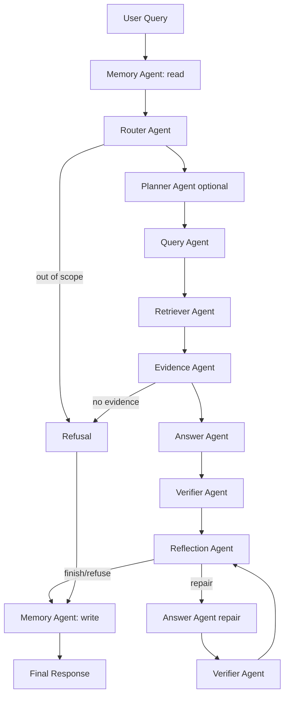

# Agent 模块设计说明

## 1. 设计目标

当前项目已经具备 Agentic RAG 的核心能力：记忆读取、问题路由、查询增强、混合检索、证据融合、证据化回答、答案校验、修正/拒答和记忆写入。之前这些能力主要集中在 `hybrid_service.py` 中，虽然能跑通，但不利于展示 Agent 角色边界，也不利于后续测试和扩展。

本轮改造目标是把隐含在主流程里的 Agentic RAG 步骤拆成显式模块：

```text
Memory Agent
  ↓
Router Agent
  ↓
Planner Agent(optional)
  ↓
Query Agent
  ↓
Retriever Agent
  ↓
Evidence Agent
  ↓
Answer Agent
  ↓
Verifier Agent
  ↓
Reflection Agent
  ↓
Memory Agent
```

重点不是“把所有代码都叫 Agent”，而是让每个模块有明确职责、输入输出和可测试边界。

## 2. 不做假 Agent 的原则

`笔记/agents模块设计.md` 中最重要的一点是：不要为了项目名称或简历效果过度拆分 Agent。

本项目采用以下判断标准：

| 类型 | 是否作为 Agent | 原因 |
|---|---|---|
| 问题路由 | 是 | 需要根据问题类型选择流程，属于决策节点 |
| 查询改写/扩展 | 是 | 需要语言理解和多查询生成 |
| 检索执行 | 工具，由 Retriever Agent 协调 | Chroma/FTS/Neo4j 查询是确定性工具调用 |
| 证据去重/融合 | 组件 Agent，不调用 LLM | 是工作流阶段，但逻辑确定、可测试 |
| 答案生成 | 是 | LLM 基于证据生成自然语言答案 |
| 答案校验 | 是 | 需要判断回答与证据支持关系 |
| 修正/拒答决策 | 是 | 负责失败处理和重试策略 |
| 记忆读写 | 工程 Agent | 管理状态和持久化，不需要 LLM |
| 文档解析、缓存、格式化 | 否 | 普通工具/函数即可 |

## 3. 当前 Agent 模块

### 3.1 Memory Agent

文件：

```text
hybrid_graph_rag_app/agents/memory_agent.py
```

职责：

- 问答开始前读取短期历史、会话摘要和长期记忆。
- 根据 `memory_policy.py` 判断本轮是否使用记忆。
- 问答结束后写入对话历史，并通过门控更新长期记忆。

记忆只用于理解用户意图、偏好和上下文，不作为事实证据。

### 3.2 Router Agent

文件：

```text
hybrid_graph_rag_app/agents/router_agent.py
```

职责：

- 判断问题适合图谱优先、文档优先、混合检索，还是直接拒答。
- 输出 `RouteDecision`。

当前使用规则路由，不默认使用 LLM Router。原因是当前场景类别有限，规则更稳定、成本更低、可解释性更强。

### 3.3 Planner Agent

文件：

```text
hybrid_graph_rag_app/agents/planner_agent.py
```

职责：

- 识别复杂问题，如对比、多方面、先后步骤、多实体问题。
- 默认关闭，避免每个问题都额外规划。
- 启用后可生成少量子问题，交给 Query/Retriever 后续处理。

### 3.4 Query Agent

文件：

```text
hybrid_graph_rag_app/agents/query_agent.py
```

职责：

- 包装 `QueryEnhancer`。
- 执行查询改写、多查询扩展和可选 HyDE。
- 使用记忆上下文辅助理解追问，但不把记忆当作事实依据。

### 3.5 Retriever Agent

文件：

```text
hybrid_graph_rag_app/agents/retriever_agent.py
```

职责：

- 协调文档检索和图谱检索。
- 对每个扩展查询分别检索。
- 保留 Chroma semantic、SQLite FTS 和 Neo4j 的降级逻辑。

底层 `VectorRetriever.search()` 和 `GraphRetriever.search()` 仍是工具函数。

### 3.6 Evidence Agent

文件：

```text
hybrid_graph_rag_app/agents/evidence_agent.py
```

职责：

- 将文档结果转成 `[Sx]` 证据。
- 将图谱结果转成 `[Gx]` 证据。
- 去重、排序、融合并控制最终证据数量。

该模块不调用 LLM，因为证据融合目前是确定性逻辑。

### 3.7 Answer Agent

文件：

```text
hybrid_graph_rag_app/agents/answer_agent.py
```

职责：

- 基于本轮证据生成答案。
- 强制关键事实引用 `[Sx]` 或 `[Gx]`。
- LLM 失败时使用保守模板。
- 根据 Verifier 反馈修订答案。

### 3.8 Verifier Agent

文件：

```text
hybrid_graph_rag_app/agents/verifier_agent.py
```

职责：

- 检查答案是否引用有效证据。
- 判断答案是否被证据支持。
- 输出 `verified`、`uncertain` 或 `refused`。

### 3.9 Reflection Agent

文件：

```text
hybrid_graph_rag_app/agents/reflection_agent.py
```

职责：

- 根据校验结果决定是否接受答案、修订答案或拒答。
- 限制最大重试次数，避免无限循环。
- 当前第一版保留“一次修订 + 再校验 + 低置信拒答”的稳定策略。

## 4. Workflow 状态流

文件：

```text
hybrid_graph_rag_app/agents/workflow.py
hybrid_graph_rag_app/agents/state.py
```

主状态对象 `AgentWorkflowState` 在各 Agent 间传递：

```text
query
session_id
memory_context
memory_prompt
route
planned_queries
expanded_queries
vector_results
graph_results
evidence
draft
verification
retry_count
final_response
trace
```

主流程：



## 5. 为什么暂不强制 LangGraph

LangGraph 很适合表达状态图、条件边、循环、checkpoint 和多 Agent 编排。当前项目的节点命名和状态对象已经按 LangGraph 迁移思路设计。

但本项目优先保证：

- 用户本地环境能直接运行。
- 不因为新增依赖导致 FastAPI demo 失败。
- 当前评估结果不回退。

因此第一阶段采用纯 Python `AgentWorkflow`，后续可以把同样的节点迁移为 LangGraph `StateGraph`：

```text
memory_read → route → plan → query_expand → retrieve → evidence_fuse → answer → verify → reflect → memory_write
```

## 6. 错误处理策略

| 场景 | 处理方式 |
|---|---|
| 明显超出知识库范围 | Router 直接进入拒答 |
| 文档和图谱都无证据 | 直接拒答 |
| LLM 生成失败 | Answer Agent 使用保守 fallback |
| Verifier 不确定 | Reflection Agent 触发一次修订 |
| 修订后仍低置信 | 拒答 |
| 记忆写入不通过门控 | 不写长期记忆，只保存短期历史 |

## 7. API 与前端

本轮改造保持 `/api/chat` 返回结构稳定：

- `answer`
- `status`
- `confidence`
- `route`
- `verification`
- `sources`
- `vector_results`
- `graph_results`
- `memory_usage`
- `used_memories`
- `memory_write_result`

Agent trace 默认不返回。后续如果开启 `INCLUDE_AGENT_TRACE`，可在前端新增“Agent 执行链路”卡片。

## 8. 评估方式

基础验证：

```powershell
python -m compileall "hybrid_graph_rag_app" "eval" "tests"
python eval/eval_rag.py
python eval/eval_memory.py
```

测试维度：

- Router 决策是否正确。
- Evidence 融合顺序是否符合 route。
- Verifier / Reflection 是否能修订或拒答。
- API response schema 是否保持稳定。
- 评估结果是否不明显回退。

## 9. 简历表达

可以描述为：

> 设计并重构 Agentic RAG 多智能体工作流，将原有单体编排拆分为 Memory、Router、Query、Retriever、Evidence、Answer、Verifier、Reflection 等职责明确的 Agent 模块；通过显式状态对象管理多阶段输入输出，并设计一次修订与拒答机制，在保持 API 兼容和本地可运行的前提下提升系统可解释性、可测试性与面试展示价值。

## 10. 后续扩展

- 将 Python Workflow 迁移到 LangGraph StateGraph。
- Planner Agent 支持真实多跳问题拆解。
- Reflection Agent 支持 query rewrite + second retrieval。
- 增加 Agent trace 前端展示。
- 增加 LangSmith/OpenTelemetry 链路追踪。
- 扩展 Agent 评估指标，如 Tool Call Accuracy、Route Accuracy、Repair Success Rate。
