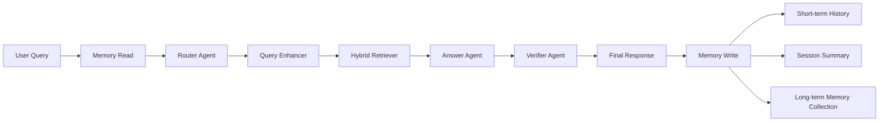

# 分层记忆模块设计

## 1. 设计目标

当前系统只有短期会话历史：每个 session 保存最近若干轮 human/ai 消息，用于理解追问。这种方式可以解决单次会话内的上下文连续性，但存在明显限制：

- 只能记住最近几轮，长对话会被截断。
- 不会形成稳定用户画像或主题摘要。
- 跨会话时无法复用用户偏好、历史主题和已确认事实。
- 如果把完整历史直接塞进 prompt，会增加上下文长度、成本和干扰。

因此，本项目引入轻量分层记忆：

```text
短期记忆 Short-term Memory
  ↓
会话摘要 Summary Memory
  ↓
长期语义记忆 Long-term Semantic Memory
```

目标不是让记忆替代知识库，而是让记忆辅助理解用户、补全追问和个性化检索。最终事实回答仍必须由本轮知识库证据 `[Sx]` / `[Gx]` 支撑。

## 2. 参考原则

结合 LangChain / LangGraph 对长期记忆的实践，长期记忆通常分为：

| 类型 | 含义 | 本项目采用方式 |
|---|---|---|
| Semantic Memory | 用户事实、偏好、稳定信息 | 作为长期记忆条目保存 |
| Episodic Memory | 历史交互经验、案例 | 暂不单独实现，用会话摘要近似 |
| Procedural Memory | 系统规则、行为偏好 | 保留在 prompt 和项目配置中 |

长期记忆应跨 session 持久化，而短期记忆只服务当前 session。读取记忆可以在主流程开始时进行，写入记忆则放在回答完成后，避免阻塞核心检索链路。

## 3. 推荐架构



## 4. 三层记忆设计

### 4.1 短期记忆 Short-term Memory

保存位置：

```text
hybrid_graph_rag_app/data/conversation_history.json
```

用途：

- 保存最近多轮对话。
- 支持当前 session 内追问。
- 给 Query Enhancer 提供上下文。

当前配置：

```text
最近 8 轮对话
```

短期记忆可以直接保留现有实现。

### 4.2 会话摘要 Summary Memory

保存位置：

```text
hybrid_graph_rag_app/data/session_summaries.json
```

用途：

- 将较长历史压缩为摘要。
- 降低 prompt 长度。
- 记录当前 session 的主题、用户关注点、已经讨论过的问题。

建议结构：

```json
{
  "demo-user": {
    "summary": "用户主要在询问夏朝、孙子曰和图谱关系，希望回答带证据。",
    "updated_at": "2026-xx-xx xx:xx:xx",
    "turn_count": 12
  }
}
```

更新策略：

- 每轮回答后更新。
- 优先使用轻量规则摘要。
- 如果 LLM 可用，可让 LLM 生成更自然的摘要。

### 4.3 长期语义记忆 Long-term Semantic Memory

保存位置：

```text
hybrid_graph_rag_app/data/long_term_memory.json
```

用途：

- 保存跨会话稳定信息。
- 例如用户偏好、长期关注主题、明确提出的项目目标。
- 支持下次会话中检索相关记忆。

建议结构：

```json
{
  "demo-user": [
    {
      "memory_id": "mem-...",
      "user_id": "demo-user",
      "content": "用户希望项目说明适合 HR 和面试官阅读。",
      "category": "preference",
      "importance": 0.85,
      "confidence": 0.9,
      "status": "active",
      "source": "conversation",
      "source_turn_id": "demo-user-2026-xx-xx xx:xx:xx",
      "evidence_type": "user_explicit",
      "created_at": "2026-xx-xx xx:xx:xx",
      "updated_at": "2026-xx-xx xx:xx:xx",
      "last_accessed_at": "2026-xx-xx xx:xx:xx",
      "access_count": 3,
      "ttl_days": 180,
      "tags": ["resume", "project"],
      "contradicted_by": null,
      "metadata": {
        "extract_reason": "用户明确表达了偏好或要求。"
      }
    }
  ]
}
```

记忆类别：

| 类别 | 示例 |
|---|---|
| `preference` | 用户喜欢简历式表达、希望回答简洁 |
| `profile` | 用户正在做 RAG 项目、关注大模型应用岗 |
| `project` | 当前项目目标是 Agentic RAG 可信问答 |
| `constraint` | 不希望答案无证据编造 |

## 5. 记忆读写策略

### 5.1 记忆使用决策

不是每个问题都应该读取长期记忆。当前实现先通过 `memory_policy.py` 判断是否启用记忆：

| 场景 | 策略 |
|---|---|
| 用户明确说“不要用记忆 / 忽略历史” | 不读取任何记忆 |
| 追问、代词、省略上下文 | 读取短期历史、摘要和长期记忆 |
| 简历、风格、面试、项目等偏好/背景问题 | 读取摘要和长期记忆 |
| 明确事实型知识库问题 | 不读取记忆，只依赖本轮检索证据 |

API 会返回 `memory_usage` 字段，说明本轮是否使用记忆、使用了哪些记忆层以及原因。

### 5.2 读取时机

在用户问题进入 Router 前读取：

```text
query + session_id
  ↓
MemoryManager.load_context()
  ↓
short_history + summary + relevant_long_term_memories
```

读取结果传给：

- Query Enhancer：帮助补全追问。
- Router：帮助判断是否是延续性问题。
- Answer Agent：提供个性化偏好和上下文。

但 Answer Prompt 要继续强调：

```text
记忆只用于理解用户意图和偏好，不作为事实证据。
事实回答必须引用知识库证据。
```

### 5.3 写入时机

回答完成后写入：

```text
query + answer + verification_result
  ↓
MemoryManager.update()
```

写入内容包括：

1. 短期历史：保存原始问答。
2. 会话摘要：更新 session summary。
3. 长期记忆：只提取高价值信息。

### 5.4 什么应该写入长期记忆

应该写入：

- 用户明确表达的偏好。
- 用户长期目标。
- 项目稳定背景。
- 已确认的约束条件。

不应该写入：

- 普通知识库事实。
- 未被证据支持的回答内容。
- 一次性闲聊。
- 敏感信息。
- 模型猜测出的用户属性。

### 5.5 写入门控与冲突处理

当前实现不会把所有对话直接写入长期记忆，而是先抽取候选，再经过写入门控：

```text
query + answer + status + confidence
  ↓
_extract_memory_candidates()
  ↓
_write_gate()
  ↓
去重 / 更新已有记忆 / 新增记忆 / 标记冲突
```

门控条件包括：

- 类别必须属于 `preference`、`profile`、`project`、`constraint`、`task_state`、`style`。
- 置信度必须达到 `LONG_TERM_MEMORY_WRITE_CONFIDENCE`。
- 重要度必须达到 `LONG_TERM_MEMORY_WRITE_IMPORTANCE`。
- 疑似敏感信息不写入。
- 普通知识库事实不写入用户长期记忆。

如果新记忆与同类别旧记忆出现明显冲突，旧记忆会被标记为 `contradicted`，并记录 `contradicted_by`，而不是直接删除。这样可以保留可追溯性。

## 6. 检索策略

当前不强制引入新的向量库，先实现轻量关键词检索：

```text
query 与 memory.content 做关键词重合评分
  + importance
  + access_count
  - 时间衰减
```

排序公式可以简化为：

```text
score = keyword_overlap + importance * 2 + access_bonus - age_decay
```

返回 top-k 条长期记忆。

后续可升级为：

- 使用 embedding 向量检索长期记忆。
- 使用 Chroma 单独存储 memory collection。
- 使用 Neo4j 建立记忆之间的关系。

## 7. 与现有 Agent 的交互

| 模块 | 如何使用记忆 |
|---|---|
| Router Agent | 根据 summary 和长期记忆判断是否是延续性问题 |
| Query Enhancer | 用 summary 和相关记忆补全模糊查询 |
| Retriever Agent | 可用记忆中的主题词增强检索 query |
| Answer Agent | 根据用户偏好调整表达方式，但事实仍来自证据 |
| Verifier Agent | 发现答案和记忆约束冲突时可降低可信度 |
| Memory Manager | 回答后更新短期历史、摘要和长期记忆 |

## 8. 为什么不直接使用复杂图记忆

项目已经有 Neo4j 图谱检索，但长期记忆不建议第一步直接放入 Neo4j，原因是：

- 用户记忆规模较小，用 JSON/KV 已足够。
- 图记忆需要设计节点、边、TTL 和冲突处理，复杂度高。
- 当前目标是提升 Agentic RAG 项目的可解释能力，不是做完整个人助理系统。

因此第一版采用：

```text
JSON 持久化 + 分层结构 + 关键词检索 + TTL/重要度
```

这是最容易落地且便于面试解释的方案。

## 9. 评估方式

新增 `eval/eval_memory.py` 和 `eval/eval_memory_questions.jsonl`，用于独立评估记忆模块，不依赖完整 RAG 检索链路。当前覆盖三类指标：

| 指标 | 含义 |
|---|---|
| Memory Usage Accuracy | 判断本轮是否应该读取记忆，以及读取哪些记忆层 |
| Memory Write Gate Accuracy | 判断用户偏好、项目背景、事实型问题是否被正确写入或跳过 |
| Memory Recall@K | 写入长期记忆后，后续相关追问能否召回目标记忆 |

运行方式：

```bash
python eval/eval_memory.py
```

输出：

```text
eval/eval_memory_report.jsonl
eval/eval_memory_summary.json
```

## 10. 后续升级路线

第一版：

- 短期历史
- 会话摘要
- 长期语义记忆 JSON 存储
- 关键词检索
- TTL/importance/access_count

第二版：

- LLM 提取长期记忆
- embedding 检索长期记忆
- 记忆冲突检测
- 用户手动删除记忆

第三版：

- LangGraph Store
- Chroma memory collection
- 图结构记忆
- 记忆评估集和 RAGAS 对比实验

## 10. 简历表达

可以在简历中描述为：

> 设计并实现分层记忆模块，将对话历史拆分为短期会话记忆、会话摘要记忆和长期语义记忆。系统在问答前检索用户相关记忆辅助查询改写和路由判断，在回答后根据用户偏好、项目目标和高置信约束更新长期记忆，同时限制记忆仅用于意图理解与个性化表达，事实性回答仍必须由知识库证据支撑，从而兼顾跨会话连续性与可信问答约束。
