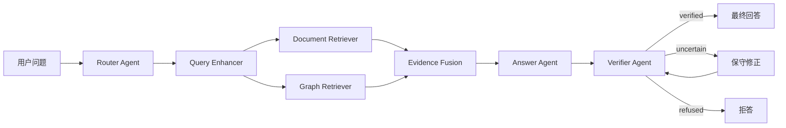

# Agentic RAG 智能知识问答系统详细介绍

## 1. 项目定位

本项目是一个基于 **Agentic RAG** 的智能知识问答系统，目标是把原有的普通 RAG 问答项目升级为一个更完整、更可信、更适合展示的知识库问答应用。

传统 RAG 通常是：

```text
用户问题 → 单次检索 → 拼接上下文 → LLM 生成答案
```

这种方式虽然能完成基础问答，但存在几个明显问题：

1. 检索策略固定，无法根据问题类型动态调整。
2. 对实体关系、精确关键词、多跳问题支持不足。
3. LLM 容易在证据不足时凭常识补全，产生幻觉。
4. 回答中缺少清晰证据引用，用户无法判断答案来源。
5. 没有自动校验机制，无法区分可靠回答和不可靠回答。

因此，本项目升级为 Agentic RAG 流程：

```text
用户问题
  ↓
Router Agent 判断问题类型
  ↓
Query Enhancer 改写/扩展查询
  ↓
Hybrid Retriever 检索文档和图谱证据
  ↓
Evidence Fusion 统一证据链
  ↓
Answer Agent 基于证据生成答案
  ↓
Verifier Agent 校验答案可信度
  ↓
返回回答 / 修正回答 / 拒答
```

最终系统强调的是：

```text
不是只回答，而是带证据、可校验、可拒答地回答。
```

## 2. 当前主应用

当前项目主应用位于：

```text
hybrid_graph_rag_app/
```

原来的：

```text
rag_web_app/
```

保留为历史版本，不再作为主要开发入口。

原因是旧版 `rag_web_app` 中的主链路当前实际使用的是未检索版本：

```python
llm_chain_unretrieve(llm)
```

也就是说旧版应用存在绕过 RAG 检索的问题。而 `hybrid_graph_rag_app` 已经具备：

- FastAPI 后端
- Web 页面
- 文档检索
- Neo4j 图谱检索
- 路由逻辑
- 对话历史
- 证据展示

所以本次升级以 `hybrid_graph_rag_app` 作为主线。

## 3. 项目整体架构

整体架构如下：



核心流程可以理解为：

1. 用户输入问题。
2. Router 判断问题更适合文档检索、图谱检索还是混合检索。
3. Query Enhancer 根据历史和原问题生成更适合检索的查询。
4. Retriever 同时检索文档库和图谱库。
5. Evidence Fusion 将文档片段和图谱事实统一成证据。
6. Answer Agent 只基于证据生成回答。
7. Verifier Agent 检查答案是否被证据支持。
8. 如果答案可信，则返回；如果不可信，则修正或拒答。

## 4. 核心 Agent / 节点设计

当前项目已经把主流程拆分到：

```text
hybrid_graph_rag_app/agents/
```

其中 `workflow.py` 负责显式状态流转，`state.py` 定义内部状态和 Agent trace。这样 `hybrid_service.py` 只保留对外 façade，负责初始化依赖并委托 AgentWorkflow 执行。详细设计见：

```text
AGENT_MODULE_DESIGN.md
```

设计原则是：需要决策、生成、验证和反思的步骤作为 Agent；确定性检索、去重、格式化仍作为工具或组件，避免为了“多 Agent”而增加无效延迟。

### 4.1 Router Agent

位置：

```text
hybrid_graph_rag_app/hybrid_service.py
```

主要方法：

```python
route_query()
```

职责：

- 判断问题类型。
- 选择检索策略。
- 输出路由模式和理由。

当前支持的路由模式：

| 路由模式 | 含义 |
|---|---|
| `graph_first` | 图谱优先，适合实体属性、关系、别名、外文名等问题 |
| `document_first` | 文档优先，适合总结、解释、原文内容类问题 |
| `hybrid` | 混合检索，同时使用文档和图谱 |
| `insufficient_or_out_of_scope` | 明显超出知识库范围，直接拒答 |

示例：

```text
夏朝的外文名是什么？ → graph_first
孙子曰这部分内容主要讲了什么？ → document_first
请结合文档和图谱说明一个相关实体的基本信息 → hybrid
火星殖民计划预算是多少？ → insufficient_or_out_of_scope
```

当前 Router 是规则型 Agent，而不是每次都调用 LLM。这样做的好处是：

- 稳定
- 成本低
- 延迟低
- 面试讲解清晰
- 便于后续替换成 LangGraph 节点

### 4.2 Query Enhancer

位置：

```text
hybrid_graph_rag_app/query_enhancer.py
```

类：

```python
QueryEnhancer
```

职责：

- 根据历史对话补全当前问题。
- 生成多个检索问法。
- 可选生成 HyDE 假设文本。

当前内部包含三个链：

```python
rewrite_chain
multi_query_chain
hyde_chain
```

作用示例：

```text
用户问题：它的外文名是什么？

结合历史后可能改写为：
夏朝的外文名是什么？

多查询扩展可能生成：
夏朝英文名是什么？
夏朝别名是什么？
夏朝的外文名称是什么？
```

当前配置中：

```python
QUERY_EXPANSION_ENABLED = True
QUERY_EXPANSION_NUM = 3
HYDE_ENABLED = False
```

HyDE 默认关闭，因为它会增加一次 LLM 调用，也可能引入额外幻觉。后续如果需要增强召回，可以打开。

### 4.3 Retriever Agent

位置：

```text
hybrid_graph_rag_app/hybrid_service.py
```

主要方法：

```python
_retrieve()
```

Retriever Agent 本身负责协调两个检索器：

1. 文档检索器
2. 图谱检索器

#### 4.3.1 Document Retriever

位置：

```text
hybrid_graph_rag_app/vector_retriever.py
```

类：

```python
VectorRetriever
```

职责：

- 优先使用 Chroma 语义检索。
- 如果 embedding 环境不可用，则降级使用 SQLite FTS 检索。
- 将检索结果转换成统一 Evidence。

运行模式：

| 模式 | 含义 |
|---|---|
| `semantic` | 使用 Chroma + embedding 相似度检索 |
| `fts` | 使用 Chroma SQLite 内部 FTS/BM25 风格检索 |
| `disabled` | 文档检索不可用 |

文档证据 ID 格式：

```text
S1, S2, S3...
```

示例：

```text
[S1] document source=sample.txt
这里是被检索到的文档片段内容
```

#### 4.3.2 Graph Retriever

位置：

```text
hybrid_graph_rag_app/graph_retriever.py
```

类：

```python
GraphRetriever
```

职责：

- 从用户问题中提取关键词。
- 查询 Neo4j 中的实体关系。
- 返回图谱事实。
- 转换成统一 Evidence。

图谱证据 ID 格式：

```text
G1, G2, G3...
```

示例：

```text
[G1] graph source=Neo4j:夏朝
夏朝 -[外文名]- Xia Dynasty
```

### 4.4 Evidence Fusion

位置：

```text
hybrid_graph_rag_app/hybrid_service.py
```

主要方法：

```python
_fuse_evidence()
```

职责：

- 合并文档证据和图谱证据。
- 去重。
- 根据路由模式调整顺序。
- 控制最终输入给 LLM 的证据数量。

不同路由下的策略：

| 路由 | 融合方式 |
|---|---|
| `graph_first` | 图谱证据排前面，文档证据辅助 |
| `document_first` | 文档证据排前面，图谱证据辅助 |
| `hybrid` | 文档证据和图谱证据交错融合 |

最终传给 LLM 的不是原始 dict，而是统一的 Evidence 结构。

### 4.5 Answer Agent

位置：

```text
hybrid_graph_rag_app/hybrid_service.py
```

主要方法：

```python
_generate_answer()
```

职责：

- 接收用户问题。
- 接收对话历史。
- 接收本轮检索证据。
- 调用 LLM 生成答案。

Prompt 中明确要求：

```text
你只能依据“本轮证据”回答，不能使用外部常识补充事实。
对话历史只用于理解追问，不可作为事实证据。
如果可以回答，答案中的关键事实必须带证据编号，例如 [S1] 或 [G2]。
如果证据不足，直接回答“知识库中没有足够依据回答该问题”。
```

这意味着系统不会让模型随便发挥，而是强制它围绕证据回答。

### 4.6 Verifier Agent

位置：

```text
hybrid_graph_rag_app/verifier.py
```

类：

```python
AnswerVerifier
```

职责：

- 检查答案是否引用了证据编号。
- 检查引用的证据编号是否真实存在。
- 调用 LLM 判断答案是否被证据支持。
- 输出结构化校验结果。

校验结果结构：

```python
VerificationResult(
    supported=True,
    confidence=0.65,
    status="verified",
    reason="...",
    unsupported_claims=[]
)
```

支持的状态：

| 状态 | 含义 |
|---|---|
| `verified` | 回答基本被证据支持 |
| `uncertain` | 回答存在不确定或证据不足 |
| `refused` | 拒答 |

如果答案没有引用 `[S1]` 或 `[G1]`，Verifier 会直接认为不可信。

### 4.7 Repair / Refusal

如果 Verifier 输出 `uncertain`，系统会尝试一次保守修正：

```python
_repair_answer()
```

修正后会再次进入 Verifier。

如果仍然不可靠，或者置信度低于阈值，就拒答：

```text
知识库中没有足够依据回答该问题。
```

这就是系统的可信闭环：

```text
生成 → 校验 → 修正 → 再校验 → 通过或拒答
```

## 5. 统一数据结构

位置：

```text
hybrid_graph_rag_app/schemas.py
```

核心结构包括：

### 5.1 RouteDecision

表示路由结果：

```python
RouteDecision(
    mode="hybrid",
    graph_score=1,
    doc_score=1,
    summary="mode=hybrid...",
    strategies=["document", "graph"],
    reason="..."
)
```

### 5.2 Evidence

表示统一证据：

```python
Evidence(
    evidence_id="S1",
    type="document",
    content="...",
    source="sample.txt",
    score=0.8,
    metadata={...}
)
```

### 5.3 AnswerDraft

表示答案草稿：

```python
AnswerDraft(
    answer="...",
    cited_sources=["S1", "G1"]
)
```

### 5.4 VerificationResult

表示校验结果：

```python
VerificationResult(
    supported=True,
    confidence=0.65,
    status="verified",
    reason="...",
    unsupported_claims=[]
)
```

### 5.5 FinalResponse

表示最终 API 响应：

```python
FinalResponse(
    answer="...",
    status="verified",
    confidence=0.65,
    route=route,
    verification=verification,
    sources=sources,
    vector_enabled=True,
    vector_backend="semantic",
    vector_results=[],
    graph_results=[]
)
```

## 6. 对话记忆模块

位置：

```text
hybrid_graph_rag_app/memory_manager.py
hybrid_graph_rag_app/memory_policy.py
hybrid_graph_rag_app/history_store.py
```

当前记忆模块升级为轻量分层记忆，详细设计见：

```text
MEMORY_MODULE_DESIGN.md
```

分为三层：

```text
Short-term Memory：当前 session 最近多轮对话
Summary Memory：当前 session 摘要
Long-term Semantic Memory：跨会话用户偏好、项目背景和稳定约束
```

持久化路径：

```text
hybrid_graph_rag_app/data/conversation_history.json
hybrid_graph_rag_app/data/session_summaries.json
hybrid_graph_rag_app/data/long_term_memory.json
```

当前不是简单地把历史全部塞进 prompt，而是先做记忆使用决策：

| 场景 | 策略 |
|---|---|
| 用户明确要求不用记忆 | 跳过全部记忆 |
| 追问、省略、代词问题 | 使用短期历史、摘要和长期记忆 |
| 简历、风格、面试、项目背景问题 | 使用摘要和长期记忆 |
| 明确事实型知识库问题 | 不使用记忆，只依赖本轮证据 |

长期记忆条目包含 `confidence`、`status`、`source_turn_id`、`evidence_type`、`tags`、`contradicted_by` 等字段。回答完成后，系统会通过写入门控决定是否保存长期记忆，只保存用户偏好、项目背景、稳定约束和高价值任务状态，不保存普通知识库事实或敏感信息。

记忆的作用：

1. 帮助 Query Enhancer 理解追问。
2. 帮助 Answer Agent 理解用户偏好和项目背景。
3. 支持跨会话召回用户长期需求。
4. 通过 `memory_usage`、`used_memories`、`memory_write_result` 暴露本轮记忆决策。

但系统明确限制：

```text
记忆只用于理解用户意图、偏好和上下文，不作为事实证据。
事实回答仍然必须来自本轮检索到的 [S1] 或 [G1]。
```

## 7. 文档切分与向量库

当前新版系统没有重新实现文档切分和建库流程，而是复用已有向量库：

```text
vectorstore_rag/
```

也就是说：

```text
已有文档切分结果 / 已有 Chroma 向量库
        ↓
VectorRetriever 检索
        ↓
转成 Evidence
        ↓
进入问答流程
```

原项目中文档切分逻辑主要在：

```text
数据处理/数据划分.py
```

原有思路大致是使用递归文本切分，参数类似：

```text
chunk_size = 400
chunk_overlap = 40
```

当前新版系统重点是问答可信链路，而不是重新建库。

如果后续继续增强，建议补一个标准 indexing pipeline：

```text
文档上传 / 读取
  ↓
文本清洗
  ↓
RecursiveCharacterTextSplitter
  ↓
chunk_size=500, chunk_overlap=80
  ↓
写入 Chroma
  ↓
写入 FTS/BM25 索引
```

## 8. Web 页面效果

页面位置：

```text
hybrid_graph_rag_app/templates/chat.html
```

页面展示内容包括：

1. 用户输入问题。
2. Session ID。
3. 回答内容。
4. 路由模式。
5. 可信状态。
6. 置信度。
7. Verifier 校验说明。
8. 记忆使用决策、召回记忆和写入结果。
9. 引用来源。
10. 图谱证据。
11. 文档证据。

页面中证据展示会把文档和图谱分开展示，方便用户看到答案来自哪里。

## 9. API 接口

### 9.1 首页

```http
GET /
```

返回聊天页面。

### 9.2 问答接口

```http
POST /api/chat
```

参数：

```text
query: 用户问题
session_id: 会话 ID
```

返回示例结构：

```json
{
  "answer": "核心回答：... [S1]",
  "status": "verified",
  "confidence": 0.65,
  "route": {
    "mode": "document_first",
    "summary": "mode=document_first...",
    "reason": "问题更像解释、总结或原文内容查询"
  },
  "verification": {
    "supported": true,
    "confidence": 0.65,
    "status": "verified",
    "reason": "校验通过",
    "unsupported_claims": []
  },
  "sources": [],
  "vector_results": [],
  "graph_results": [],
  "memory_usage": {
    "use_memory": true,
    "memory_types": ["summary", "long_term"],
    "reason": "问题涉及用户项目背景、表达偏好或长期目标。",
    "risk_level": "low"
  },
  "used_memories": [],
  "memory_write_result": {
    "written": false,
    "memory_id": null,
    "reason": "",
    "skipped_reason": "候选记忆未通过写入门控。",
    "contradicted_ids": []
  }
}
```

### 9.3 健康检查

```http
GET /api/health
```

返回：

```json
{
  "status": "ok",
  "app": "hybrid_graph_rag",
  "vector_backend": "semantic",
  "graph_endpoint": "neo4j@127.0.0.1:8687",
  "routing": "enabled",
  "verifier": "enabled",
  "response_schema": "trusted_rag_v1",
  "query_expansion": true,
  "hyde": false
}
```

## 10. 评估模块

评估入口：

```text
eval/eval_rag.py
```

测试集：

```text
eval/test_questions.jsonl
```

运行：

```powershell
python eval/eval_rag.py
```

输出：

```text
eval/eval_report.jsonl
eval/eval_summary.json
```

评估内容包括：

- 问题类型
- 路由模式
- 回答状态
- 置信度
- 文档证据数量
- 图谱证据数量
- 总证据数量
- 延迟
- Verifier 原因
- 自动推断 outcome

当前轻量评估最近一次结果：

| 指标 | 数值 |
|---|---:|
| 测试问题数 | 7 |
| verified | 6 |
| refused | 1 |
| pass | 4 |
| review | 3 |
| 平均置信度 | 0.5571 |
| 平均延迟 | 1785.40 ms |
| 平均证据数 | 3.43 |

路由分布：

| 路由 | 数量 |
|---|---:|
| graph_first | 3 |
| document_first | 2 |
| hybrid | 1 |
| insufficient_or_out_of_scope | 1 |

其中无答案问题已经触发拒答。

### 10.1 RAGAS 可选评估

脚本：

```text
eval/eval_ragas.py
```

运行：

```powershell
python eval/eval_ragas.py
```

如果没有安装：

```text
ragas
datasets
```

脚本会提示并退出，不影响主系统。

### 10.2 记忆模块评估

脚本：

```text
eval/eval_memory.py
```

测试集：

```text
eval/eval_memory_questions.jsonl
```

运行：

```powershell
python eval/eval_memory.py
```

评估内容包括：

- Memory Usage Accuracy：是否正确判断本轮是否读取记忆。
- Memory Write Gate Accuracy：是否正确写入/跳过长期记忆。
- Memory Recall@K：长期记忆写入后是否能在后续追问中召回。

## 11. 配置说明

配置文件：

```text
hybrid_graph_rag_app/settings.py
```

关键配置：

```python
VECTOR_TOP_K = 6
GRAPH_KEYWORD_LIMIT = 3
GRAPH_RESULT_LIMIT = 8
FINAL_EVIDENCE_LIMIT = 10
FINAL_SOURCE_LIMIT = 6
MIN_VERIFICATION_CONFIDENCE = 0.55
QUERY_EXPANSION_ENABLED = True
QUERY_EXPANSION_NUM = 3
HYDE_ENABLED = False
PER_QUERY_VECTOR_TOP_K = 4
PER_QUERY_GRAPH_LIMIT = 4
```

环境变量示例：

```text
config/.env.example
```

内容：

```text
MODEL_NAME=your-model-name
API_KEY=your-api-key
BASE_URL=https://your-compatible-openai-endpoint/v1
```

真实配置应写入：

```text
config/.env
```

该文件已经在 `.gitignore` 中，不应该提交。

## 12. 启动方式

安装依赖：

```powershell
pip install -r requirements.txt
```

复制环境变量：

```powershell
Copy-Item config/.env.example config/.env
```

启动服务：

```powershell
python -m uvicorn hybrid_graph_rag_app.app:app --host 0.0.0.0 --port 8010
```

访问页面：

```text
http://127.0.0.1:8010
```

健康检查：

```powershell
curl http://127.0.0.1:8010/api/health
```

## 13. Docker 支持

项目根目录提供：

```text
Dockerfile
```

构建：

```powershell
docker build -t agentic-rag-self .
```

运行：

```powershell
docker run --rm -p 8010:8010 --env-file config/.env agentic-rag-self
```

注意：Docker 镜像默认不包含本地模型、向量库和 Neo4j 数据目录：

```text
model/
vectorstore_rag/
neo4j_kg_db/
```

如果要在 Docker 内完整使用检索能力，需要额外挂载这些目录。

## 14. 当前降级策略

为了让项目在本地环境不完整时仍能运行，系统设计了多级降级：

| 场景 | 降级方式 |
|---|---|
| embedding 模型不可用 | 文档检索降级为 FTS |
| LLM 调用失败 | 使用保守模板回答 |
| Verifier 调用失败 | 使用证据引用规则做保守校验 |
| 图谱不可用 | 继续使用文档检索 |
| 文档和图谱都没有证据 | 拒答 |

## 15. 当前项目文件说明

```text
README.md
```

项目总说明。

```text
hybrid_graph_rag_app/README.md
```

子应用说明。

```text
hybrid_graph_rag_app/agents/
```

显式 Agent 模块目录，包含 Memory、Router、Query、Planner、Retriever、Evidence、Answer、Verifier、Reflection 和 Workflow。

```text
hybrid_graph_rag_app/app.py
```

FastAPI 入口，提供页面、问答接口、健康检查。

```text
hybrid_graph_rag_app/hybrid_service.py
```

核心 Agentic RAG 对外服务入口，初始化依赖并委托 `agents/workflow.py` 执行显式 Agent 工作流。

```text
hybrid_graph_rag_app/query_enhancer.py
```

查询改写、多查询扩展、可选 HyDE。

```text
hybrid_graph_rag_app/vector_retriever.py
```

文档检索。

```text
hybrid_graph_rag_app/graph_retriever.py
```

图谱检索。

```text
hybrid_graph_rag_app/verifier.py
```

答案校验。

```text
hybrid_graph_rag_app/schemas.py
```

统一数据结构。

```text
hybrid_graph_rag_app/history_store.py
```

短期对话历史。

```text
eval/eval_rag.py
```

轻量评估脚本。

```text
eval/eval_ragas.py
```

可选 RAGAS 评估。

```text
tests/
```

基础烟测。

## 16. 当前已完成能力

目前已经完成：

- FastAPI Web 问答页面
- 显式 Agent Workflow：Memory、Router、Query、Retriever、Evidence、Answer、Verifier、Reflection
- Router Agent
- Query Enhancer
- 文档检索
- 图谱检索
- 统一 Evidence 证据结构
- Answer Agent
- Verifier Agent
- 修正与拒答逻辑
- 分层对话记忆：短期历史、会话摘要、长期语义记忆
- 记忆使用决策、写入门控、冲突标记和前端展示
- 前端可信状态展示
- 轻量评估脚本
- 可选 RAGAS 脚本
- Dockerfile
- `.env.example`
- `.gitignore`
- 根目录 README
- 基础测试文件

## 17. 仍可继续增强的方向

当前系统已经具备完整 Demo 能力，但如果继续深入，可以增强：

1. **正式文档导入/切分/建库 pipeline**
   - 支持上传文档
   - 自动清洗
   - 自动切分
   - 自动写入 Chroma/FTS

2. **真正的 cross-encoder reranker**
   - 接入 `bge-reranker-base`
   - 对初检结果重新排序

3. **LangGraph 显式工作流**
   - 将当前 Python pipeline 改造成 LangGraph 节点
   - 更适合画图和面试展示

4. **更完整的 Memory Agent**
   - embedding 召回长期记忆
   - 用户手动查看、删除和修正记忆
   - 后台异步记忆抽取
   - LangGraph Store 接入

5. **RAGAS 完整评估**
   - faithfulness
   - answer relevancy
   - context precision
   - context recall

6. **更丰富的知识库**
   - 技术文档
   - 产品客服文档
   - 法律/说明书类文档

7. **截图和演示材料**
   - 页面截图
   - 问答案例
   - 评估表格
   - 架构图

## 18. 面试讲解版本

可以这样介绍项目：

> 这是一个基于 Agentic RAG 的可信知识问答系统。我在传统 RAG 的基础上加入了 Router、Query Enhancer、Retriever、Answer 和 Verifier 多阶段流程。系统会先判断问题类型，再进行多查询扩展，并同时检索文档向量库和 Neo4j 图谱库。所有检索结果会被统一成带编号的 Evidence，例如 `[S1]` 文档证据和 `[G1]` 图谱证据。Answer Agent 只能基于这些证据生成答案，Verifier Agent 会进一步检查答案是否引用了有效证据以及是否被证据支持。如果证据不足，系统会拒答而不是让模型自由发挥。前端页面会展示路由、回答、证据链、校验状态和置信度，同时评估脚本可以统计路由分布、平均延迟和拒答效果。

## 19. 一句话总结

本项目现在是一个以 `hybrid_graph_rag_app` 为主入口的 **Agentic RAG 可信问答系统**，核心特点是：

```text
动态路由 + 显式 Agent Workflow + 多查询增强 + 文档/图谱混合检索 + 证据引用 + 答案校验 + 拒答机制 + 分层记忆 + 可视化展示 + 评估脚本
```
