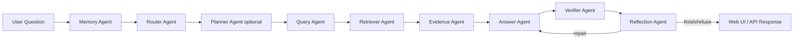

# Agentic RAG 智能知识问答系统

这是一个从传统 RAG 项目升级而来的 **Agentic RAG 可信知识库问答系统**。系统通过问题路由、多查询检索增强、文档/图谱混合检索、证据引用和答案校验，减少普通 RAG 中常见的检索不足、无引用回答和幻觉问题。

当前主应用位于：

```text
hybrid_graph_rag_app/
```

旧版 `rag_web_app/` 保留为历史版本，不再作为主要入口。

## 核心亮点

- **Agent Workflow**：显式拆分 Memory、Router、Query、Retriever、Evidence、Answer、Verifier、Reflection 等 Agent 模块。
- **Query Enhancer**：支持问题改写、多查询扩展；HyDE 作为配置开关保留。
- **Hybrid Retriever**：融合 Chroma/FTS 文档检索与 Neo4j 图谱检索。
- **Evidence Citation**：统一输出 `[S1]` 文档证据和 `[G1]` 图谱证据。
- **Answer Agent**：只基于本轮检索证据生成答案。
- **Verifier Agent**：校验答案是否引用有效证据，输出可信状态和置信度。
- **Refusal Mechanism**：证据不足时拒答，避免模型自由发挥。
- **Evaluation**：提供轻量 RAG 评估、记忆模块评估和可选 RAGAS 评估入口。
- **Layered Memory**：短期历史、会话摘要和长期语义记忆协同工作，并通过使用决策、写入门控和冲突标记降低记忆污染。
- **Web UI**：展示回答、路由、可信校验、引用来源、文档证据和图谱证据。

## 架构



底层检索仍复用 Chroma/FTS 与 Neo4j 工具；不是所有确定性步骤都调用 LLM，避免为了“多 Agent”而增加无效延迟。

## 目录结构

```text
hybrid_graph_rag_app/
  agents/             # 显式 Agent 工作流：Memory/Router/Retriever/Evidence/Answer/Verifier/Reflection
  app.py              # FastAPI 入口
  hybrid_service.py   # Agentic RAG 主流程
  query_enhancer.py   # 查询改写、多查询扩展、可选 HyDE
  memory_manager.py   # 分层记忆：短期历史、会话摘要、长期语义记忆
  history_store.py    # 短期对话历史读写
  vector_retriever.py # 文档语义/FTS 检索
  graph_retriever.py  # Neo4j 图谱检索
  verifier.py         # 答案可信校验
  schemas.py          # 统一数据结构
  templates/chat.html # Web 页面

eval/
  eval_rag.py         # 轻量批量评估
  eval_memory.py      # 记忆使用、写入门控和召回评估
  eval_ragas.py       # 可选 RAGAS 评估
  test_questions.jsonl
  eval_memory_questions.jsonl

config/
  .env.example        # 环境变量示例
```

## 快速开始

安装依赖：

```powershell
pip install -r requirements.txt
```

准备环境变量：

```powershell
Copy-Item config/.env.example config/.env
```

编辑 `config/.env`：

```text
MODEL_NAME=your-model-name
API_KEY=your-api-key
BASE_URL=https://your-compatible-openai-endpoint/v1
```

启动应用：

```powershell
python -m uvicorn hybrid_graph_rag_app.app:app --host 0.0.0.0 --port 8010
```

访问：

```text
http://127.0.0.1:8010
```

健康检查：

```powershell
curl http://127.0.0.1:8010/api/health
```

健康检查会返回路由、查询增强、Verifier 和分层记忆状态，例如 `memory=layered`、`long_term_memory=enabled`。

## API 返回结构

`POST /api/chat` 返回：

- `answer`：最终回答或拒答。
- `status`：`verified`、`uncertain`、`refused`。
- `confidence`：可信置信度。
- `route`：路由策略和原因。
- `verification`：校验结果、原因和未支持陈述。
- `sources`：最终引用证据。
- `vector_results`：文档检索结果。
- `graph_results`：图谱检索结果。
- `memory_usage`：本轮是否使用记忆、使用哪些记忆层和决策原因。
- `used_memories`：本轮召回的长期记忆。
- `memory_write_result`：本轮长期记忆是否写入、跳过原因和冲突标记。

## 评估

运行轻量评估：

```powershell
python eval/eval_rag.py
```

生成：

```text
eval/eval_report.jsonl
eval/eval_summary.json
```

`eval_summary.json` 会汇总：

- 路由分布
- 状态分布
- 平均置信度
- 平均延迟
- 平均证据数量
- 按问题类型统计的结果

可选 RAGAS：

```powershell
python eval/eval_ragas.py
```

运行记忆模块评估：

```powershell
python eval/eval_memory.py
```

记忆评估会覆盖是否应该读取记忆、长期记忆写入门控和长期记忆召回。

如果未安装 `ragas` 和 `datasets`，脚本会提示并退出，不影响主流程。

## 当前评估结果

最近一次轻量评估结果：

| 指标 | 数值 |
| --- | ---: |
| 测试问题数 | 7 |
| Verified | 6 |
| Refused | 1 |
| Pass | 4 |
| Review | 3 |
| 平均置信度 | 0.5571 |
| 平均延迟 | 1785.40 ms |
| 平均证据数 | 3.43 |

路由分布：`graph_first=3`、`document_first=2`、`hybrid=1`、`insufficient_or_out_of_scope=1`。其中无答案问题已触发拒答。

## Docker

```powershell
docker build -t agentic-rag-self .
docker run --rm -p 8010:8010 --env-file config/.env agentic-rag-self
```

注意：Docker 默认不包含本地 `model/`、`vectorstore_rag/`、`neo4j_kg_db/`。如需完整检索能力，需要挂载这些目录或直接在宿主机运行。

## 降级策略

- embedding 不可用时，文档检索降级到 FTS。
- LLM 不可用时，答案生成降级为保守模板。
- Verifier 不可用时，先使用证据引用规则校验。
- 文档和图谱均无证据时，系统拒答。

## 简历描述示例

**Agentic RAG 智能知识问答系统**

- 设计并实现基于 FastAPI、LangChain、Chroma、Neo4j 的 Agentic RAG 问答系统，支持文档和图谱混合检索。
- 构建 Router、Query Enhancer、Answer、Verifier 多阶段流程，实现动态路由、多查询扩展、证据引用和答案可信校验。
- 设计拒答机制和置信度输出，在证据不足时避免模型凭空回答。
- 开发可视化页面展示路由、证据链、Verifier 状态、引用来源和记忆使用过程，并提供批量评估脚本统计延迟、置信度、检索结果分布和记忆模块表现。

## 当前主线

后续开发优先围绕 `hybrid_graph_rag_app` 进行。`rag_web_app` 中存在绕过检索的旧链路，保留为历史参考，不建议继续作为主应用维护。
