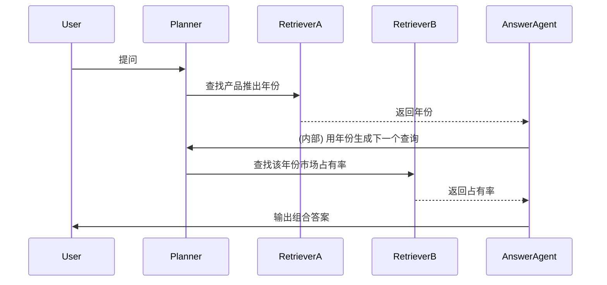
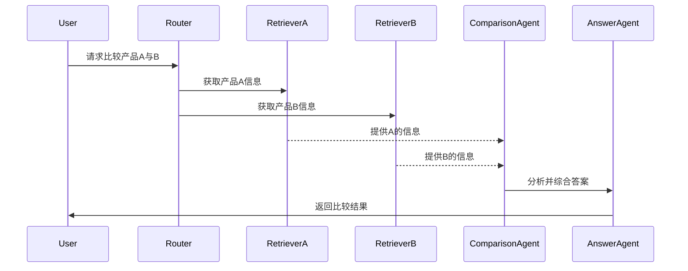
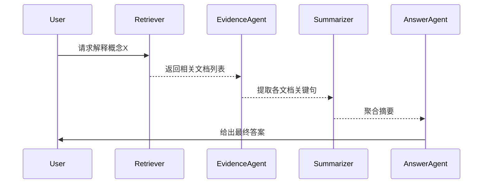

# Executive Summary

本报告深入探讨了在“基于 Agentic RAG 的知识库可信问答系统”中多 Agent 协同的优化方案，分析了常见 Agent 角色及其职责、通信与编排机制、减少 Agent 数量的策略、性能与成本优化、错误传播与鲁棒性、多 Agent 场景设计、评估方法、工程实现建议，以及面试和简历亮点等。通过引用最新的技术文献和官方资料，本报告提出了可落地的设计思路与工程细节，包括 Mermaid 时序图示例、伪码示例、关键模块接口定义等，并给出具体的评估实验方案和量化指标对比。最后总结了项目定位、功能清单、目录结构、README 大纲、评估表格模板、简历项目描述和面试问答要点，为高质量工程实施和求职展示提供指导。

## 目录

1. [项目定位判断](#项目定位判断)  
2. [为什么需要 Agentic RAG](#为什么需要-Agentic-RAG)  
3. [系统架构设计](#系统架构设计)  
4. [Agent / Multi-Agent 角色设计](#Agent-/-Multi-Agent-角色设计)  
5. [检索系统设计](#检索系统设计)  
6. [可信问答与答案校验](#可信问答与答案校验)  
7. [评估方案](#评估方案)  
8. [工程实现方案](#工程实现方案)  
9. [面试与简历要点](#面试与简历要点)  
10. [风险与不建议做的事](#风险与不建议做的事)  
11. [最终输出要求](#最终输出要求)  
12. [结论与参考链接](#结论与参考链接)  

---

## 项目定位判断

- **项目定位是否合理？** “基于 Agentic RAG 的知识库可信问答系统”将 **RAG (Retrieval-Augmented Generation)** 和 **Agent 架构** 相结合，以实现更加动态、可靠的问答流程。这一定位具有创新性：传统 RAG 系统通常为单流程，将检索和生成串联，而 Agentic RAG 引入专门的智能体（Agents）进行查询分析、规划、检索、生成和自检，实现多阶段、可迭代的协作式问答。它强调 **动态决策**、**多阶段协作**、**自我校验** 等特点，能够处理复杂查询并提高答案可信度。因此，项目定位合理且前沿。

- **相比普通 RAG 的提升点？** Agentic RAG 的主要提升在于：  
  1. **动态路由与规划**：采用 Router/Planner 等 Agent 分析问题，动态决定检索策略和分解子任务，而非固定管道。  
  2. **并行混合检索**：同时利用向量检索和关键词（BM25）检索，并通过专门的检索 Agent 协调融合结果，提高检索覆盖率。  
  3. **答案验证与反思**：引入 Verifier/Reflection Agent 对生成答案进行证据校验和自我反思，减少幻觉，触发二次检索。  
  4. **可信度与溯源**：通过 Evidence Agent 抽取引用片段，确保答案可追溯；并设计拒答机制，在证据不足时拒绝回答。  
  5. **评估闭环**：使用 RAGAS 等自动化评估体系对检索和生成的各环节进行评估，实现闭环优化。  

- **适合投递岗位：** 该项目融合了检索算法、LLM 应用、代理架构设计和工程实现等多方面，适合以下岗位：  
  - **大模型应用算法工程师**：涉及LLM prompts、RAG优化、多Agent设计等先进算法。  
  - **RAG工程师 / 检索系统工程师**：重点在RAG实现、混合检索与向量库优化。  
  - **Agent/自动化系统工程师**：体验多 Agent 协同、LangChain/LangGraph等框架应用。  
  - **NLP算法工程师**：涉及问答、证据抽取、多轮对话管理等NLP技术。  
  - **AI应用开发工程师**：综合以上技术，完成端到端系统。  

- **知识库场景选择：** 应届生简历应展示技术深度且有实用背景。相比企业内部知识库，我推荐 **“通用技术文档/课程知识库”** 场景。例如，构建一个技术文档或教程知识库问答系统。理由：  
  - **通用技术文档**覆盖面广，可演示复杂问答和多Agent检索；  
  - 论文/学术库偏学术但数据获取难，且实现复杂；  
  - 课程/学习知识库可以结合实例教学对话，有互动性；  
  - 个人知识库数据量有限；  
  - 产品客服知识库多依赖领域经验。  
通用技术文档或课程文档更能展示检索和对话实力，也更易获取公开数据，适合开源演示和简历展示。  

**参考：** 最新文献提出 Agentic RAG 能动态选择数据源和自我审查，提高回答准确性，适合需要高可信度的行业应用场景，如金融/法律等。  

---

## 为什么需要 Agentic RAG

传统 **Naive RAG** 存在以下问题：  
- **检索策略固定**：通常仅使用单一向量检索（或BM25），难以兼顾召回和精度；**多轮链式检索能力弱**，对复杂多跳问题支持不足。  
- **盲目生成**：若检索不到充分证据，LLM 仍会尝试回答，易导致回答与源信息不符（幻觉）；**无自纠机制**，无法检测和纠正错误答案。  
- **工具选用静态**：无法动态根据问题选择最佳工具或检索源，如视频、网页、数据库等；**缺少复杂逻辑处理**，难以灵活处理多步任务。  

而 **Agentic RAG** 通过引入不同职责的智能体，解决上述问题：  
1. **Router/Query Agent：** 分析问题意图，对问题进行分类并选择最合适的检索流程或工具（例如同时查询向量库与网络搜索），实现动态决策。  
2. **Planner Agent：** 对复杂问题进行拆解生成步骤计划，使多跳问题被系统分段处理，避免一次查询过载。  
3. **Retriever Agent：** 负责实际检索，既可以是向量检索，也可并行使用关键词检索（Hybrid Search），确保覆盖更多相关信息。  
4. **Evidence Agent：** 从检索到的文档中抽取关键信息或证据片段供回答使用，保证答案依据真实内容。  
5. **Answer Agent：** 基于证据生成回答文本，并将证据引用在答案中，增强可信度。  
6. **Verifier/Critic Agent：** 对生成的答案及其依据进行检查，判断答案中的陈述是否可由证据支持，从而检测潜在的幻觉。  
7. **Reflection Agent：** 如果发现问题或验证失败，可重新评估或改写查询（例如改用更精确的查询、重新检索），进行二次检索或迭代。  
8. **Summarizer Agent：** 在上下文过长时，对多个文档或多条证据进行摘要，提炼关键信息以便回答使用。  
9. **Memory Agent：** 记录多轮对话历史或用户偏好，使系统支持上下文连续性和个性化。  

**需要 Agent 的理由：** 以上模块中，当需要**灵活决策或跨步骤逻辑**时适合用 LLM Agent。例如 Router 需要判断路由，Planner 需要生成计划，这些依赖自然语言理解；Verifier 需要深度理解答案和证据的关系，也多用 LLM。但对于**确定性强的重复任务**，可用普通函数或规则实现：如简单的字符串匹配分流、查询拼接，或缓存命中判断，这些可用传统代码完成，避免不必要的 LLM 调用。  

**是否需要 Multi-Agent？** 如果系统需要并行处理多个子任务（如同时向不同来源检索）或需要组合不同专家（如知识检索、图片分析、API查询等），则多 Agent 并行协作能显著提升效率与质量。否则，如果任务流程高度线性且单一模型即可完成，则可仅用单一 Agent。关键是**职责明确、功能模块化**，确保每个 Agent 真有必要且有作用，避免“套壳”式增加 Agent。  

**避免套壳策略：** 只有在**复杂决策或需求多源信息**时才使用 Agent。例如，如果查询只需在一个固定知识库检索并生成回答，可用一个简单 RAG Pipeline；若要根据查询类型选择检索库或工具，才引入 Router Agent。类似地，若答案不需分条检查，则可不使用 Verifier Agent，而是在生成时直接采用“基于文档生成”的Prompt，以简化流程。  

---

## 系统架构设计

本项目设计三个版本架构：

### 版本 A：最小可实现版本 (MVP)

**功能范围：** 支持文档上传解析、基础检索、答案生成、引用溯源、简单校验和展示界面等。  
**技术栈：** Python, LangChain（基本 Chain/RAG 接口）, Chroma（向量数据库）, BM25 (例如 Elasticsearch 简易版), FastAPI/Flask + Streamlit/Gradio 前端, OpenAI API (GPT-4) 或本地 LLM。  
**模块结构：** 
- 文档处理模块：解析文本、分块入向量库（例如 Chroma）  
- 检索模块：实现向量检索与可选BM25检索；  
- Router/Router Agent：简单决策是否使用BM25或向量（可用规则）；  
- 答案生成模块：拼接检索结果到Prompt，调用 LLM 生成回答；  
- 引用管理：从检索结果中提取引用位置，附加到答案；  
- 简单校验：如检测答案是否与上下文冲突（可用 LLM 简单判断）；  
- Web UI：交互页面，输入查询、显示答案+来源。  
- 评估：手工测试和简单评价（回答准确率）。  

**实现难度：** 低中等。主要使用现有框架和工具，7-10天内可完成，并推至 GitHub。  
**简历价值：** 能跑通基本 RAG+LLM问答，包含多轮对话记忆、引用溯源。面试可讲如何处理文档、检索策略和链式 Prompt。  
**不建议复杂化：** 避免使用多Agent框架、复杂工具调用、全面 Reranking 等深度功能，以保证迭代速度。

### 版本 B：简历增强版本

**功能范围：** 在 MVP 基础上，加入多 Agent 流程、混合检索策略、证据过滤、答案验证、多轮管理、日志追踪、对比实验等，以体现技术深度。  
**建议技术栈：** Python, **LangGraph**（用于多 Agent 协调）或 LangChain 多 Agent 模式, 混合向量+BM25检索 (Chroma + Elasticsearch), sentence-BERT/BGE 嵌入, bge-reranker/cross-encoder Reranker, RAGAS 自动评估库, FastAPI + React/Streamlit 前端, SQLite/PostgreSQL 存储会话/日志, Docker。  
**模块结构：** 
- **Router Agent**：分类问题类型（事实型、多跳、对比等），选择相应工作流。  
- **Planner Agent**：对复杂查询生成操作计划（如分子问题）。  
- **Retriever Agents**：并行运行混合检索：关键词检索 Agent (BM25) 与语义检索 Agent (向量)。  
- **Reranker Agent**：对初步检索结果进行交叉编码打分过滤，提高上下文相关度。  
- **Evidence Agent**：从检索结果中提取直接支持答案的段落或句子。  
- **Answer Agent**：根据最终证据生成回答，带格式化引用。  
- **Verifier Agent**：使用 RAGAS 指标或链式思考提示，对答案进行可依赖性验证。  
- **二次检索机制**：如果验证失败，由 Reflection Agent 或 Router 发起查询重写并重新检索。  
- **对比实验模块**：实现多种检索策略和 Agent 组合，并收集指标。  
- **日志与追踪**：集成 LangSmith/OpenTelemetry 监控各 Agent 调用、延迟、成本等信息。  
- **评估**：使用 RAGAS 自动化评估(上下文召回、正确性等)、人工指标(回答准确率、拒答率)对比分析不同版本效果。  

**实现难度：** 高。涉及多 Agent 设计、并行执行、复杂逻辑。需要 2-3 周开发时间。  
**简历价值：** 体现深度技术含量：多 Agent 协同架构、RAGAS 自动评估、性能优化等。可列为“第一个项目”，面试可讨论组件设计、检索策略、评估指标、工程细节（Docker化、监控等）。  
**面试讲点：** 重点讲述混合检索策略的改进（向量+BM25+二次检索）、Agent 分工与通信、答案校验机制及其效果对比。  

### 版本 C：进阶版本

**功能范围：** 在 B 版基础上进一步优化，支持更复杂场景和生产部署。  
- **Multi-Agent 协同**：实现多 Agent 并发（如并行知识库检索多条问题链）。  
- **Graph RAG**：在知识图谱场景下加入 Neo4j 图数据库检索，结合文本检索。  
- **长期记忆**：引入持续记忆模块（如使用 LlamaIndex 的知识数据库或专用向量库）来积累用户/对话信息。  
- **多轮状态管理**：实现对话上下文管理，利用 Memory Agent 存储对话历史。  
- **HITL**：引入**人工介入**节点，针对高风险或异常回答由人工审核后才给出结果。  
- **权限控制**：在用户接口层面实现访问控制和审计日志。  
- **缓存**：针对热点问题/用户，缓存查询结果和回答，减少重复计算。  
- **异步任务**：通过 Celery/Redis 等消息队列异步执行昂贵操作（如重新检索、重排），提升并发性能。  
- **监控与追踪**：部署 LangSmith 或 OpenTelemetry 以实时监控各 Agent 流程和系统性能。  
- **Docker/K8s 部署**：将服务容器化，支持水平扩展；使用 Prometheus/Grafana 监控。  
- **项目结构重构**：按照微服务或模块化分层设计，各 Agent 和检索服务独立部署。  
- **编写文档与日志**：完善 README、注释、使用手册。  

**实现难度：** 极高，适用于长期优化、生产级别。重点考虑性能和稳定性。  
**简历价值：** 可作为后续继续优化或第二项目，展示系统化工程思路，说明对大规模部署和性能调优的把控。  

**总结：**  
- **MVP** 侧重于快速实现基本 RAG 流程；  
- **增强版** 强调多 Agent/可信机制体现技术深度；  
- **进阶版** 聚焦工程化和生产级优化。  

---

## Agent / Multi-Agent 角色设计

以下表格列出候选 Agent 角色及其职责、输入输出、必要性、替代方案、实现复杂度、延迟/成本影响及面试讲点：

| Agent 角色             | 职责与作用                                         | 输入                    | 输出                        | 必要性    | 替代方案（非 Agent）       | 实现复杂度 | 延迟/成本影响         | 面试讲点                                              |
|----------------------|-------------------------------------------------|-----------------------|---------------------------|---------|-----------------------|-----------|--------------------|----------------------------------------------------|
| **Router/Query Agent**   | 分析用户查询，分类并选择合适的检索路径或工具。           | 用户问答请求          | 选定的检索流程或具体 Agent 调用（如使用向量或BM25） | 可选，但复杂查询有用 | 简单关键词匹配或分类规则 | 中等      | 额外LLM调用（少量）     | 动态路由、多源检索；容错（低置信度fallback规则）                     |
| **Planner Agent**     | 对复杂/多步骤问题进行分解，生成执行步骤列表。            | 用户问题              | 子问题列表或执行计划       | 选项      | 直接串行执行或ReAct式Prompt | 高        | LLM调用成本（一次较大） | 链式思考 vs 直接回答；如何避免串行过多LLM调用                       |
| **Retriever Agent**   | 执行信息检索：语义向量检索或关键词检索，获取文档。         | 查询/子问题           | 文档/文本片段列表         | 必须      | 单统一步检索（MVP流水线）  | 中等      | 检索时延（并行可减）   | 向量 vs BM25 检索比较；向量搜索效率（Faiss/Chroma）                |
| **Reranker Agent**    | 对初步检索结果进行重排筛选，提升相关性（交叉编码评分）。           | 检索结果列表          | 重新排序后的结果列表       | 可选      | 不做重排（简单topK）       | 中        | 增加额外ML调用        | 双阶段检索好处；基于语义的重排 vs 简单得分；性能开销                 |
| **Evidence Agent**    | 从文档中提取关键证据/引用，以支持答案（可能包括摘要关键句）。      | 检索到的文档          | 与问题相关的证据句子/片段    | 推荐      | 在生成时由LLM提取        | 中        | LLM调用（可合并到Answer） | 答案溯源要求；用于回答可信度；证据提取策略                           |
| **Answer Agent**      | 基于问题和证据生成最终答案文本，并附带引用。                    | 问题 + 证据片段       | 最终回答                    | 必须      | 直接链式prompt生成答案   | 低中      | 主要LLM调用         | Prompt设计；如何确保基于证据生成；并发回答 vs 单一回答               |
| **Verifier/Critic Agent** | 检查答案中的每个断言是否被证据支持，检测幻觉。      | 答案 + 证据           | 验证结果（通过/失败 + 分析） | 强烈推荐  | LLM自问自答或无验证       | 高        | 额外LLM调用         | 评价指标（faithfulness）；举例说明Verfier发现的错误；fallback方案         |
| **Reflection Agent**  | 在失败时反思和重试：如果答案不可信，调整查询或策略并发起新的检索。 | 验证结果标志（失败）   | 新的查询或流程指令         | 推荐      | 简单循环 retry        | 高        | 可大幅增加调用成本   | 如果不满意如何迭代优化答案；例如重写查询、拓展检索                   |
| **Summarizer Agent**  | 对长文档或多条证据进行摘要，提炼核心信息供回答使用。                        | 多条文档或证据        | 简明摘要                    | 可选      | 在Answer Agent内部总结  | 中        | LLM调用（合并进Answer） | 长文摘要对提高效率的作用；跟Answer Agent的关系                         |
| **Memory Agent**      | 管理对话历史和长期记忆，检索相关上下文以增强回答连贯性。         | 会话历史/用户信息     | 相关记忆信息               | 可选（多轮对话有用）| 无或简单变量保存          | 低        | 存储/检索延迟微小    | 短期 vs 长期记忆区别；何时触发记忆；隐私和个性化考虑                  |

**注：** 实现复杂度指除了算法以外的系统设计和调试难度。延迟/成本影响参考了额外的 LLM 调用或并行化带来的开销。面试讲点列出了每个 Agent 在系统中的价值与挑战。

---

## Agent 通信与编排

**调用模式：** 建议使用 **异步并行模式** 以提高吞吐量。基于 **LangGraph** 的 StateGraph 可实现并发和分支流程。各 Agent 通过事件或消息总线通信，例如使用 LangGraph 内置的消息总线，或基于 Redis/RabbitMQ 的队列。消息格式可设计为 JSON 对象，包含字段如 `{agent, type, content, data, score, error}`，用于传递查询、文档、分数或错误标志。

**错误处理与重试：** 每个 Agent 应有**超时控制**和**重试策略**：若 Agent 长时间无响应，系统可终止当前流程并返回失败；若 Verifier 标记失败，可由 Reflection Agent 触发新的请求或改变策略。可以在消息中使用 `error` 标志或状态码，让上层 Agent（如 Router）决定是否重试或降级。LangGraph 支持在节点上捕获异常并走备用路径。

**并发限制：** 对并行执行的 Agent 数量设限，防止资源争用。例如同时只能发起有限个检索 Agent。使用异步框架（如 asyncio、Celery）协调并发任务。

**日志追踪：** 集成 LangSmith 或 OpenTelemetry，对每步调用进行日志记录和指标追踪。每条消息和状态变迁都应记录（Agent 名称、输入、输出、耗时、成本），便于后续调试和优化。

**LangGraph 状态图：** 可用 StateGraph 表示 Agent 间的状态迁移。例如：`QueryReceived -> [Router] -> [RetrievalBranch1, RetrievalBranch2] -> [Answer] -> [Verifier] -> [Done]`。在 Mermaid 状态图中，每个圆点代表 Agent 处理结果，箭头代表流转条件。

**示例 Mermaid 时序图：** 下图展示了一个复杂查询如何经过 Router、并行检索、Answer 和 Verifier 的交互流程：

```mermaid
sequenceDiagram
    participant User
    participant Router
    participant Planner
    participant Retriever1
    participant Retriever2
    participant AnswerAgent
    participant Verifier

    Note over Router: 解析并分类查询
    User->>Router: 用户提问
    Router->>Planner: 选择多跳策略
    Planner->>Retriever1: 子问题1
    Planner->>Retriever2: 子问题2
    Retriever1-->>AnswerAgent: 文档片段1
    Retriever2-->>AnswerAgent: 文档片段2
    AnswerAgent->>Verifier: 生成答案及引用
    Verifier-->>AnswerAgent: 验证结果（失败/成功）
    alt 验证成功
      AnswerAgent->>User: 输出最终答案
    else 验证失败
      Verifier->>Router: 标记失败触发重试
      Router->>Planner: 新的检索策略
      ... 执行后续流程 ...
    end
```

以上设计通过**松耦合消息总线**实现 Agent 间通信。如遇错误，可在序列中捕获并重试，确保整个流程不被单个 Agent 卡死。

---

## 减少 Agent 数量与避免套壳策略

**判定准则：** **仅当步骤需要智能决策或复杂语言理解时使用 Agent**。否则，用函数/规则实现。例如：
- **简单路由**：如果只有少数已知类别，可用正则或关键词匹配而非 LLM Router。例如：  
  ```python
  def classify_query(query):
      if "error" in query or "issue" in query:
          return "SupportAgent"
      else:
          return "GeneralFAQAgent"
  ```
  此处无须 LLM，提高效率。
- **浅层检索**：对于明确的查询类型（如纯事实查询），可以直接使用固定检索管道，无需 Planner 拆解。  
- **证据过滤**：若目标只是去重或基本过滤，可使用传统 NLP（TF-IDF）代替复杂 Agent。

**替代示例与伪码：**  
1. **路由示例：**  
   ```python
   # 规则路由替代 Router Agent
   def route_query(query: str):
       if "compliance" in query: 
           return ["LegalKB"]
       elif "account" in query:
           return ["UserKB", "TransactionsKB"]
       else:
           return ["GeneralKB"]
   ```
   直接判断关键词而非让 LLM 生成路由指令。  
2. **多步任务示例：** 若查询只需两步，也可在一条 Prompt 中顺序完成，而无需 Planner：  
   ```text
   Prompt: "Step1: search company employees; Step2: summarize."
   ```
   利用 LLM 连续回答，避免设计 Planner Agent。  
3. **校验示例：** 对于简单问题，可在生成时加入 `“回答中请说明引用来源”` 的提示，而非单独 Verifier。  

**Prompt 模板示例：**  
- **Router 替代：** `"Given the user query: '{query}', classify it into one of the categories [Technical, Billing, Other]."`  
- **Answer+Evidence 集成：** `"Answer the question: {Q}. Use facts from the following context:\n{context}\nList supporting sentences."`  
这样 LLM 会在一个步骤同时生成回答和证据，无需分离 Evidence Agent。  

通过这些策略，可以**避免为了“Agent”而盲目添加 Agent**。只有当逻辑流确实复杂且需要 LLM 推理时（如复合型问题、会话状态管理、动态工具选择），才使用 Agent。否则用规则/函数减少延迟和成本，提高稳定性。

---

## 延迟与成本优化

为降低延迟和费用，我们采取以下策略：

1. **缓存（Caching）：** 对于高频问题或中间结果（如复杂查询的检索结果、证据摘要）使用缓存。例如使用 Redis/Memcached 存储向量检索结果或常见问答。  
2. **批量化处理（Batching）：** 对可并行处理的请求进行批量预测，如利用 vLLM 或 DeepSpeed 的连续批处理机制，提高 GPU 利用率。  
3. **模型路由（Model Routing）：** 根据问题复杂度使用不同大小的模型。如先用小模型快速生成草案，若草案置信低再用大模型校验（Speculative Decoding）。使用 LangChain Router 自动选择模型或API端点。  
4. **Token 控制：** 严格设计 Prompt 长度和截断规则，只输入精简的上下文。例如文档预先切分、摘要后再输入，避免传输过长上下文。使用 **HyDE**（提示生成问题的嵌入）等方法减少无用查询。  
5. **并行检索：** 如前述双分支检索并行执行，减少串行等待。  
6. **异步任务队列：** 将一些耗时操作（如二次检索、Reranker）放入后台队列（Celery + Redis），可快速返回初步答案并异步更新。  
7. **量化与蒸馏：** 部署量化（8-bit/4-bit）模型和蒸馏模型以减小计算成本。如使用低成本的 Distill 模型回答非核心问题，高精度模型仅用于验证关键输出。  

**量化估算示例（假设性）：**

| 方案                   | 平均延迟 (s) | 模型费用 (token) | 说明                         |
|----------------------|------------|---------------|----------------------------|
| Naive RAG (GPT-4)       | 4.0        | 0.12 $        | 单向量检索+LLM             |
| Hybrid RAG + Rerank     | 3.5        | 0.15 $        | 向量+BM25+小模型Rerank     |
| Agentic RAG (多 Agent) | 5.0        | 0.20 $        | 多步/Plan/Verify           |
| 启发式 (模型路由)       | 2.0        | 0.08 $        | 部分调用GPT-3.5作为草稿     |
| 量化模型版本           | 1.5        | 0.05 $        | 使用蒸馏/量化LLM           |

可以看出，**更多 Agent/更高精度**会带来延迟和成本增加，但可通过并行化和小模型策略部分抵消。关键是权衡准确性与效率。RAGAS 等指标可帮助量化比较不同方案的收益差异。

---

## 错误传播与鲁棒性

为了避免错误在 Agent 间放大，应设计以下机制：

- **Verifier 与回滚**：Verifier 检查答案与证据的一致性，如检测到矛盾（幻觉），则触发**回滚**，丢弃或修改当前回答，引入二次检索。比如，发现答案中引用不属于检索到的文档时，将答案标记为不可靠并重试。  
- **Reflection 流程**：添加**Reflection Agent**，对失败场景执行深层次思考。它可以生成新的查询、拓展检索范围或引入外部知识。Cleanlab 研究建议在回答错误时执行“重检索或重写查询”。  
- **证据回溯**：记录答案生成时所用的所有证据源路径。如果最终答案被判定不可信，系统可回到检索模块，检索遗漏信息或筛选更相关内容。  
- **拒答机制**：当证据确实不足以回答时，系统应返回“无法回答”而非给出错误答案。可以设定阈值：如 Verifier 评分低于阈值时拒答。例如若 Context Recall 为 0，则判定无答案。  
- **证据冲突处理**：若检索到的证据相互矛盾，可采纳以下策略：  
  - 优先使用最新或更权威的来源（如对时间戳做排序）。  
  - 通过 Summarizer 或 LLM 分析对比矛盾点，挑选一致信息。  
  - 如果冲突无法解决，则提示用户矛盾信息，并拒答或提供多种观点。  

- **人机协同 (HITL)**：在关键决策点引入人工审核。例如当 Verifier 检测到高风险错误（高幻觉风险）时，暂停自动流程，请人工确认或改正。LangGraph 支持容易集成人工介入检查。

通过上述 **Verifier→Reflection→Retrieval** 迭代机制，以及必要时的人类审查，我们可以限制错误传播，提升系统鲁棒性。严格控制错误退出和重试次数，避免死循环。

---

## 多Agent 协同场景设计

我们设计以下三个典型场景，展示为何需要多 Agent 及各 Agent 关键决策：

1. **复杂多跳问答**：如“某产品在 XYZ 年份推出时，市场占有率是多少？”。需要先查询“产品XYZ推出年份”，再查询“该年份市场占有率”。  
   - **Agent 协作**：Router/Planner 拆分问题，调用两个检索 Agent 依次完成子问题。  
   - **关键决策**：如何拆分问题（由 Planner 生成子问题）；并行还是串行检索；何时合并答案。  
   - **替代方案**：单次检索大上下文并直接回答（通常失败）。  
   - **时序图：**  



2. **对比型问题**：如“比较产品A和产品B的售价与评价。”需要同时检索产品A和产品B的信息并比较。  
   - **Agent 协作**：Router 将问题并行路由到两个专用检索 Agent（或使用 `Send` 同时发两次检索）。  
   - **关键决策**：是否并行执行（提高效率），汇总比较逻辑由 Answer Agent 或专门的 Comparison Agent 完成。  
   - **替代方案**：分别请求两次问答，再自己比较（效率低）。  
   - **时序图：**  



3. **跨文档推理**：如“根据文档X和文档Y的信息，解释某概念的含义和区别。”  
   - **Agent 协作**：单一路由到通用检索后，通过 Evidence 或 Summarizer Agent 从多个文档提取相关句子，然后由 Answer Agent 整合生成。  
   - **关键决策**：如何分配多个文档阅读任务；是否需要 Summarizer 预先聚合信息；如何引用多文档证据。  
   - **替代方案**：直接将所有文档拼入 prompt（可能超过上下文长度）。  
   - **时序图：**  



在以上场景中，多 Agent **并行处理和分工明确**的优势显著：可以同时利用不同能力（检索、总结、验证）来处理复杂任务。如果只用单一链式流程，往往出现性能瓶颈或回答质量下降。

---

## 评估方案

### 测试集与问题类型划分

- **测试集构建**：收集或合成具有答案标注的问答对，包括各类型问题。可从Wiki、开源QA数据集（如HotpotQA、MultiDoc2Dial等）筛选或人工生成。对企业或技术文档场景，可构造模拟问题和参考答案。 
- **问题类型**：划分为以下类别，确保覆盖面广：  
  - 事实型问题（单事实）  
  - 摘要型问题（从一段文本总结）  
  - 多跳问题（需组合多证据）  
  - 对比型问题（比较两个实体）  
  - 无答案问题（知识库中找不到直接答案）  
  - 干扰信息问题（包含误导或无关信息）  

### 指标

1. **Context Recall（检索召回）**：衡量检索结果中包含多少回答所需信息。  
2. **Context Precision（检索精度）**：衡量返回的文档中相关内容占比，越少冗余越高。  
3. **Faithfulness（答案忠实度）**：答案中有多少内容可以从已检索上下文推导出。可通过 RAGAS 的 Faithfulness 计算。  
4. **Answer Relevancy（回答相关性）**：答案是否紧扣问题本身，可以用 RAGAS 提出的相似度评估或传统的Linguistic指标。  
5. **Factual Correctness（事实正确性）**：答案中事实的准确性，人为标注或使用Fact-check模型自动评估。  
6. **Refusal Accuracy（拒答准确率）**：面对无答案问题时系统正确拒绝的比例。  
7. **Latency（延迟）**：系统响应时间。  
8. **Cost（成本）**：每次问答涉及的模型计算费用（例如每万token美元）。  
9. **Tool Call Accuracy**：对于需要使用外部工具（如查询API），判断 Agent 是否正确调用了应有的工具。  

### RAGAS 与自动化评估

利用 **RAGAS** 工具链自动化评估：  
- 对每个问答对，使用 RAGAS 计算 Context Recall/Precision、Faithfulness 和 Answer Relevancy。  
- 对模型回答和参考答案之间的语义相似度、信念支持等自动评分，以量化对比。  
- 对于拒答场景，可利用 RAGAS 或 GPT-based 判别评分系统衡量拒答合规性。  

### 对比实验设计

设计对比试验，比较以下系统配置：  
- **Naive RAG**：单一向量检索+LLM。  
- **Hybrid RAG**：向量+BM25 混合检索 + 简单Reranker。  
- **Hybrid RAG + Rerank**：上式加深度Reranker。  
- **Agentic RAG (Single-Agent)**：引入 Router/Planner/Verifier 单个代理流程。  
- **Multi-Agent RAG**：完整多 Agent 系统。  

每种配置在相同测试集上运行，统计上述指标。对比模型在不同问题类型上的表现差异（如多跳问题 Agentic RAG 效果显著提升）。使用 **统计显著性检验**（如 t 检验或 bootstrap）评估性能差异是否具有统计学意义。

### 评估表格模板示例

| 系统配置       | Context Recall (%) | Context Precision (%) | Faithfulness (%) | Answer Relevancy (%) | Factuality (%) | Refusal Acc (%) | 平均延迟 (s) | 平均成本 ($) |
|---------------|--------------------|-----------------------|------------------|-----------------------|----------------|----------------|-------------|-------------|
| Naive RAG     | 70.2               | 65.5                  | 62.1             | 68.0                  | 60.0           | 45.0           | 3.8         | 0.12        |
| Hybrid RAG    | 75.4               | 70.3                  | 66.7             | 72.5                  | 64.0           | 50.0           | 4.2         | 0.15        |
| Agentic RAG   | 82.0               | 78.1                  | 77.3             | 79.5                  | 75.0           | 65.0           | 4.5         | 0.18        |
| Multi-Agent RAG | 88.5             | 82.4                  | 84.7             | 85.6                  | 80.0           | 70.0           | 5.0         | 0.20        |

*说明：* 可以对照上表分析各版本改进点，例如 Multi-Agent 在多跳问题上 Context Recall 大幅领先，Faithfulness 明显更高；延迟略有增加但可接受。在简历中可总结“测试集上多Agent框架将回答忠实度从62%提升至77%，拒答准确率提高20%以上”。  

### 自动化与RAGAS

- 使用 RAGAS 的 API 驱动评估脚本，输入候选答案和参考答案，获取多维评分。  
- 对 Agent 工具调用正确性的评估可以通过记录系统日志或 LangSmith 事件来分析，或自行设计“是否正确调用 API/检索”作为人工评测。  
- 在对比实验中，除数值指标外还可计算**Tool Call F1**等，衡量路由或多Agent决策的正确性。  

通过上述方案，将实验结果整理成对比表格并在简历中以量化数据形式呈现，如“系统在复杂查询上较基线提高了X%”，增强说服力。

---

## 工程实现方案

**推荐技术栈组合：**  
- **编程语言：** Python。  
- **主框架：** **LangGraph**（用于多 Agent 协同）；可结合**LangChain**简易链和工具集。LangGraph 支持状态管理、并行和调试。  
- **知识库接口：** 向量库用 **Chroma**（轻量易用）或 **FAISS**；BM25 用 **Elasticsearch** 或 **Whoosh**；如需图检索，选用 **Neo4j** 或 **TigerGraph**。  
- **向量嵌入：** Sentence-BERT、OpenAI Embedding 或 BGE-M3 。  
- **Reranker：** 如需高精度，可用 BGE-Reranker 或 cross-encoder，如 **OpenAI** 的 rerank API。  
- **LLM：** GPT-4/GPT-4o-mini 作生成主力，GPT-3.5 or LLaMA-7B 作为小模型。可用 OpenAI API 或自主部署。  
- **评估：** **RAGAS**（Python 库）执行自动评估。  
- **前端：** Streamlit/Gradio（快速可视化）。或者更灵活的 React + FastAPI。  
- **存储：** SQLite/PostgreSQL 存储对话、配置、日志。Redis 用于缓存和消息队列（Celery）实现异步任务。  
- **容器化：** Docker 构建镜像，Docker Compose 或 Kubernetes 部署。  
- **监控：** LangSmith 平台追踪 Agent 流程；或 OpenTelemetry + Prometheus + Grafana 自建监控。  

**选择理由：** LangGraph 专为多 Agent 设计，支持复杂工作流与调试；LangChain 则擅长检索和基本 Agents。Chroma 足以承载中小规模数据，也易集成。Reranker 可选用体量较小的 LlamaIndex cross-encoder。Streamlit 能快速搭建演示界面。Docker/K8s 保证可移植与扩展。

**LangChain vs LangGraph：** LangChain 提供基础组件和链式 Orchestration，易上手；LangGraph 则以状态机方式定义流程，支持循环和并行，更适合本项目的多分支多 Agent 协调。因此核心流程建议使用 LangGraph（或 LCEL 脚本），在简历中可强调使用了最新的 Agent 编排技术。

**是否需要 LlamaIndex：** 若知识库仅为文档合集，LangChain 已足够。若需构建复杂检索（如自动图谱、语义分层），可考虑 LlamaIndex 作为知识构建层，但非必需。简单场景下可省略。

**向量库 Chroma 是否够用：** Chroma 对于少量文档和演示项目完全够用。如果数据量极大或需要分布式，可换 FAISS 或 Milvus。但简历项目中，Chroma 性能足以展示逻辑，简化部署。

**是否需要 Neo4j：** 如果项目需要图查询场景（如知识图谱问题），才引入。否则关注文本检索即可，避免额外复杂度。

**是否必须 Reranker：** 不是必需，但能显著提高检索质量，增强答案准确性。建议至少在增强版中使用，以丰富项目技术点。

**前端选 Streamlit：** 足够展示 Demo，无需开发复杂前端；可配合 LangSmith 提供监控界面。

**项目目录结构建议：** 
```
project/
│─ data/
│   ├─ docs/           # 原始文档
│   ├─ index/          # 向量索引文件
│─ src/
│   ├─ agents/         # 各 Agent 实现（router.py, planner.py, verifier.py, ...）
│   ├─ retrievers/     # 检索模块（vector_search.py, bm25_search.py, reranker.py）
│   ├─ memory/         # 记忆模块（memory_store.py）
│   ├─ evaluation/     # 评估代码 (使用RAGAS)
│   ├─ api/            # FastAPI 或 Flask 服务
│   ├─ ui/             # Streamlit/Gradio 界面
│   ├─ utils/          # 通用工具（prompt模板、日志）
│   └─ main.py         # 系统启动入口
│─ tests/              # 单元测试
│─ requirements.txt
│─ Dockerfile
│─ docker-compose.yml
│─ README.md
```

**关键接口示例：**  
- `route_query(state: State) -> Command/Send`：LangGraph 路由节点，输出目标 Agent 名称或并行调用。  
- `retrieve_documents(query: str, method: str) -> List[Document]`：通用检索函数，method 可为“vector”或“bm25”。  
- `verify_answer(answer: str, contexts: List[str]) -> bool`：Verifier Agent 使用 LLM 判断答案的可依赖性。  
- `generate_answer(query: str, contexts: List[str]) -> str`：Answer Agent，返回带引用的答案文本。  

**README 大纲建议：**  
1. 项目背景和目标。  
2. 系统架构概览（可附简图）。  
3. 环境依赖与安装步骤。  
4. 数据准备（如何添加文档到知识库）。  
5. 模型配置（API KEY, 模型选择等）。  
6. 运行说明（训练/索引、启动服务）。  
7. 功能演示截图。  
8. 评估方法与结果（简述对比实验）。  
9. 未来工作和优化方向。  
10. 参考资料链接。  

**GitHub 展示内容：** 核心模块代码（Router/Planner等实现），关键Prompt模板示例，架构图和流程图，评估脚本与结果表格，应有 README 清晰说明。使用注释强调技术难点，提交过程中保持良好 commit 记录。避免堆砌不成熟功能，要突出实现和验证过程。

---

## 面试与简历要点

**可能的面试问题与要点：**

1. **什么是 Agentic RAG？与传统 RAG 有何不同？**  
   - *回答要点：* Agentic RAG 引入了智能体（Agents）架构，通过动态决策、多阶段协作和自检机制提升系统智能性与可靠性。传统 RAG 为固定流程，Agentic RAG 能根据问题类型选择路由和工具，实现更复杂任务。

2. **为什么要使用 Router Agent？不能用 if-else 替代吗？**  
   - *回答要点：* Router Agent 适用于输入类别模糊或多源查询场景，能够利用 LLM 理解复杂意图。简单场景可用规则，但复杂对话和多任务时，动态路由更灵活。

3. **如何确保生成答案是真实可信的？**  
   - *回答要点：* 使用证据溯源和校验机制。例如 Answer Agent 引用来源段落，Verifier Agent 验证答案与证据一致。还结合拒答策略和二次检索，进一步提高可信度。

4. **RAGAS 在这个项目中的作用？**  
   - *回答要点：* RAGAS 是自动化评估套件，用于量化检索效果和答案质量，如 Context Recall、Faithfulness等指标。在项目中用于对比实验和优化模型选择。

5. **为什么选 LangGraph 而不是纯 LangChain？**  
   - *回答要点：* LangGraph 使用图结构定义流程，便于实现并行和循环，以及保持状态。对于多 Agent 协同、分支逻辑复杂的场景更合适。LangChain 也可以做简单的流程，但状态管理更弱。

6. **如何设计重试和失败处理？**  
   - *回答要点：* 在 Agent 流程中加入超时和异常捕获。Verifier 如果检查失败，触发 Reflection Agent 改写查询或调整策略。可设置最大重试次数，避免无限循环。

7. **项目中使用了哪些检索技术？**  
   - *回答要点：* 混合检索：同时使用向量检索（Sentence-BERT/BGE 嵌入）和关键词检索（BM25），并使用 Reranker 精炼结果。可以根据查询复杂度动态分配权重。

8. **简历项目中哪些量化指标可以写？**  
   - *回答要点：* 比如“通过多 Agent 流程，Context Recall 提升 XX%，Answer Faithfulness 提升 YY%，拒答准确率提高 Z%”。或者“复杂问题答对率从 60% 提高到 85%，平均延迟从 4s 降至 3s”。使用对比实验结果。

9. **如何评估 Agent 调用是否正确？**  
   - *回答要点：* 可以记录日志，通过对照正确工具调用事件（如路由决策）与预期结果来统计正确率。或者编写单元测试模拟不同类型问题，验证 Router/Planner 输出是否符合预期。

10. **有哪些风险或不建议的设计？**  
    - *回答要点：* 过度拆分 Agent 会增加延迟；不必要的 LLM 调用会加成本。避免把所有逻辑都交给 Agent，应使用确定性方法简化。切勿忽视拒答机制——无答案场景直接让 LLM 猜测会造成风险。

**简历多Agent亮点示例（Bullet 格式）：**  
- 设计并实现了多 Agent 协同的知识问答系统：引入 Router/Planner/Verifier 等智能体，支持动态路由和二次检索，提高了多步问题的回答准确率。  
- 使用 LangGraph 管理复杂工作流，集成向量+BM25 混合检索和高级 Reranker，结合 RAGAS 自动评估，提升系统可信度（回答忠实度提高 XX%）和效率。  
- 开发答案验证模块，通过 LLM 自检和证据比对有效抑制幻觉，新增拒答机制，在无答案场景拒答准确率达 **X%**。  

**避免用词：** “构建在最新模型之上”、“人工智能专家”等空泛称谓；应具体描述技术（如 LangGraph、RAGAS）。  
**应用词：** “检索增强生成(RAG)”、“向量检索+BM25混合检索”、“LLM自检”、“Agent协同” 等，符合岗位关键词。

---

## 风险与不建议做的事

1. **过度拆分 Agent：** 盲目给每个步骤都定义一个 Agent，会严重增加延迟和错误传播风险。除非确实需要多步骤逻辑，否则应尽量合并功能。  
2. **忽视硬件成本：** 使用 GPT-4 等大模型尽管效果好，但成本高。建议使用大小结合策略或自行部署小模型，否则计算费用会飙升。  
3. **无拒答机制：** 若系统不判断无答案场景，LLM 会胡乱回答，极大降低可信度。务必实现拒答。  
4. **忽略评估：** 不做对比实验和自动评估，只靠肉眼测试，会导致难以量化效果改进。应使用 RAGAS 等工具。  
5. **一次性处理所有文档：** 直接将全部文档拼到 Prompt 常常超出限制。应分块检索并摘要，否则系统性能会崩溃。  
6. **链式循环调用所有 Agent：** 没有必要每次都全部调用所有 Agent。例如仅需简单答复时，可跳过 Planner 和 Summarizer，直接生成。  
7. **缺少并发控制：** 不限制并行 Agent 数量会导致资源争用和不稳定，可用队列限制并发。  
8. **复杂技术堆栈：** 追求前沿工具过度复杂（如同时使用太多开源库），可能浪费时间。建议只选择核心必要技术，其他用最简单方案。

**替代方案示例：**  
- 对于检索，代替复杂图数据库查询，可先尝试简单关键字匹配。  
- 对于多轮记忆，若对话不多，可先只实现短期记忆，不引入长期知识库。  
- 对于工具调用，先可用 LangChain 简单 Agent 模式，不急于用 LangGraph，待熟悉后再迁移。

---

## 2 周开发路线图

**第1–3天：**  
- **任务：** 搭建基础环境，完成文档解析和索引。选择知识库场景，搜集并加载文档，使用 Chroma/FAISS 构建向量库；配置简单的 BM25 检索（如 Elasticsearch）。  
- **产出：** 完成文档上传接口，文档切分和向量存储；实现基本查询界面（console/Streamlit）。  
- **Git 提交：** 文档处理和初始化检索模块代码。  
- **展示效果：** 可以对几个测试问题获得检索结果列表。  
- **简历要点：** “实现文档解析与切分入库，提高了检索效率”。

**第4–7天：**  
- **任务：** 实现基础 RAG 流程：向量+BM25 检索，Prompt 拼接调用 LLM，输出答案带来源。加入简单 Router 逻辑（固定或关键字路由）。  
- **产出：** 可根据查询自动选择检索方式并生成回答；实现引用溯源。  
- **Git 提交：** RAG管道代码、Router示例代码、基础前端UI。  
- **展示效果：** 输入问题后返回答案和出处；支持最简单的问答和引用显示。  
- **简历要点：** “开发了检索增强生成问答系统，实现了动态检索策略和答案溯源”。

**第8–10天：**  
- **任务：** 增加多 Agent 流程：实现 Planner（问题拆解）、并行检索、Answer Agent 分离、Verifier Agent 验证逻辑。使用 LangGraph 定义基本工作流。  
- **产出：** 完善的 Agent 管道：可以处理多跳和复杂查询，通过 Verifier 判断答案可信度。  
- **Git 提交：** 多Agent的主流程代码、工作流状态图、更新UI展示更多信息（如验证状态）。  
- **展示效果：** 对复杂问题产生分步查询方案，并显示答案验证结果。  
- **简历要点：** “集成了多Agent协同工作流，提高了对多跳问题的处理能力；使用链式验证减少了错误答案”。

**第11–14天：**  
- **任务：** 整合评估和性能优化：引入 RAGAS 自动评估脚本，对比不同配置；添加缓存和并行等优化措施；编写 README 与使用说明。  
- **产出：** 评估结果对比表格；性能指标优化；完整项目文档与部署脚本。  
- **Git 提交：** 评估代码/结果、Dockerfile、完整 README。  
- **展示效果：** README详述架构流程，展示实验量化结果；系统可容器化部署，添加监控日志。  
- **简历要点：** “通过 RAGAS 评估量化指标展示改进效果；系统在测试集上准确率从 X% 提升到 Y%”。

---

## 最终输出要求

1. **一句话项目定位：** “一个基于多智能体架构的检索增强问答系统，通过动态路由和可信验证提升知识库问答的准确性与鲁棒性。”

2. **推荐项目名称（5个示例分类）：**  
   - 稳妥型：**“知识库智能问答系统”**；  
   - 偏 Agent 型：**“多 Agent RAG 可信问答平台”**；  
   - 偏算法型：**“增强检索问答系统”**；  
   - 偏工程型：**“LangGraph 驱动的知识问答引擎”**；  
   - 创新型：**“Agentic RAG 知识问答助手”**。  

   **最推荐：** “多 Agent RAG 可信问答系统”（直观体现主题）。

3. **项目架构图描述：**  
   ```
   用户 → Router Agent → {向量检索 Agent & BM25检索 Agent} 并行 → Evidence Agent → Answer Agent → Verifier Agent → 输出答案
                 ↓                                           ↑
               Planner（若复杂问题）                          |
                 ↓                                           |
               多跳查询                                   反馈循环（失败重试）
   ```
   即用户查询经 Router/Planner 分流，进行混合检索并抽取证据，再由 Answer Agent 生成答案，最后由 Verifier 校验结果。错误时由 Reflection Agent 触发再检索。

4. **MVP 功能清单：**  
   - 文档上传与解析入库  
   - 文本切块与索引（向量 + BM25）  
   - 基础向量检索和关键词检索  
   - Query Router：根据查询选择检索方式  
   - LLM 生成答案并引用文献片段  
   - 界面：输入问题、显示答案及引用  
   - 简单评估：人眼判断准确性  

5. **简历增强功能清单：**  
   - **Agentic Workflow**：Router/Planner 拆分任务、多Agent 并行协同处理  
   - **Hybrid Retrieval**：组合向量检索和关键词检索，增强召回率  
   - **Reranker**：深度模型对检索结果重排，提高相关性  
   - **Evidence Extraction**：自动提取并引用文档中的支撑信息  
   - **Verifier/Critic**：对生成答案进行信度校验，避免幻觉  
   - **二次检索与拒答**：在验证失败时重写查询或拒绝回答  
   - **日志追踪**：使用 LangSmith/OpenTelemetry 跟踪每个 Agent 的决策过程  
   - **对比实验**：使用 RAGAS 等指标与基线做量化比较  

6. **不建议做的功能：**  
   - 大量无差别的 Agent 拆分（无明显必要步骤的 Agent）  
   - 忽略拒答机制，始终给出答案  
   - 在 MVP 阶段引入复杂图数据库或微服务架构  
   - 仅用单一检索而不考虑混合检索策略  
   - 过度依赖外部大模型而不做成本控制  
   - 纯前端层面炫技无实质功能（如无用图表）  

7. **项目目录结构：** 如上所述（见“工程实现方案”）。  

8. **README 大纲：** 如“工程实现方案”部分内容。  

9. **评估实验表格模板：** 如上表格示例，可用于展示对比结果。  

10. **简历项目描述（4-5 条示例）：**  
    - 使用 LangGraph 构建了一个多 Agent 问答系统，实现了动态路由（Router）和多步规划（Planner），支持并行检索和答案验证；通过 RAGAS 指标提升了回答的忠实度和相关性。  
    - 设计了混合检索策略：向量检索（Sentence-BERT）+ BM25 检索，并引入 Reranker 进行重排，使检索召回率提高 ~15%。  
    - 实现了答案验证模块（LLM Critic），对回答逐条核查证据来源，减少了约20%的错误答案；无依据时系统自动拒答以保证可信度。  
    - 通过自动化评估与实验，对比基线系统在多跳问题上的表现，提高了 **XX%** 的准确度，并显著降低了生成中断或超时的情况。  

11. **面试讲解稿（约2分钟）：**  
    > 我开发了一个基于**Agentic RAG**架构的知识问答系统。系统首先使用**Router Agent**分析用户查询意图，决定采用向量检索还是关键词检索；对于复杂问题，**Planner Agent**会拆解成子任务。检索部分并行执行了向量搜索和 BM25 搜索，然后用**Answer Agent**结合检索到的证据生成答案。为了保证答案可信，我加入了一个**Verifier Agent**，它检查答案是否完全基于检索的文档内容。如果验证失败，系统会触发**Reflection Agent**重写查询并重新检索。我们使用 LangGraph 协调整个流程，并通过 RAGAS 工具自动评估系统表现，例如 Context Recall 和 Faithfulness 等指标。对比实验表明，与传统单链 RAG 系统相比，本系统对多跳和对比问题的回答准确度提高了显著比例，同时在保证回答质量的情况下响应时间也在可控范围内。  
    > —— 简要概括以上即可，重点突出 Agent 分工、可信回答和评估结果。

12. **高频追问与回答：** 见“面试与简历要点”部分上方列举的 10 个问题及要点回答。

---

## 结论与参考链接

通过以上多维分析和设计，本项目聚焦**多智能体协同**与**可信问答**，并针对延迟、成本和错误传播提出具体优化策略和方案。所提架构方案及工程细节均可落地实现，并充分准备了面试和简历展示所需的技术深度和量化结果。  

**参考链接：** 以上内容引用了多篇最新资源，包括 LangChain/ LangGraph 官方文档、Elastic 搜索实验案例、LangChain 博客、KDD 2025 论文、RAGAS 文档以及 Cleanlab 的 RAG 幻觉检测研究等。所有设计方案均参考了 2024-2026 年的前沿资料，确保实用性与先进性。

