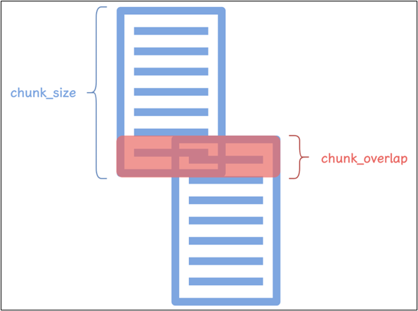
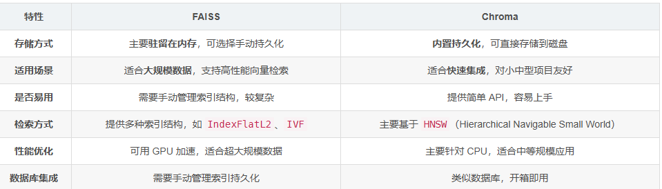
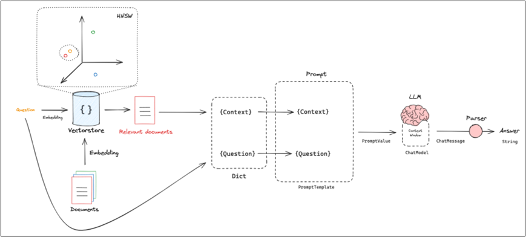
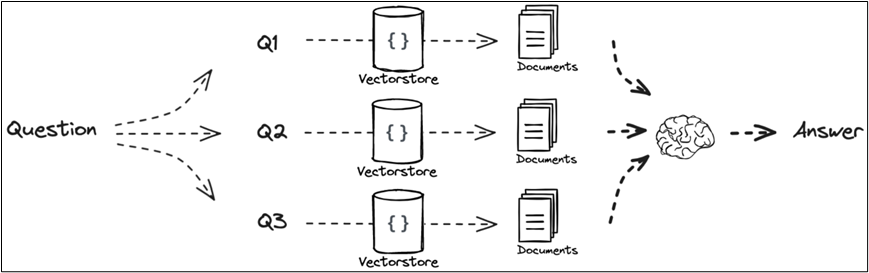

# 整体框架：
1. 索引：文档加载→文本分块→向量嵌入→向量存储。
2. 检索：查询嵌入→相似度检索→提取上下文。
3. 生成：提示工程→LLM 调度→输出后处理。
4. 服务接口：REST API 端点→流式响应→监控指标。

# 索引
## 文档加载
- 支持多种文档格式（PDF、Word、Markdown 等）。
  1. TextLoader（文本文档加载）
  2. UnstructuredMarkdownLoader（Markdown加载）
  3. PyPDFLoader（PDF加载）
  4. UnstructuredPDFLoader（PDF加载）需要三个组件
     - UnstructuredPDFLoader 解析文档
     - Poppler 开源的 PDF 文档处理库，用于渲染、解析和操作 PDF 文件。
     - Tesseract OCR 提取图像中的文字，在安装时需要选择 Additional language data(download) 来添加中文包。
  5. UnstructuredWordDocumentLoader（Word文档加载）
  6. WebBaseLoader（网站HTML加载）
- 文本清洗：去除多余空格、特殊字符等。
    1. 后续使用的 Chroma 向量数据库，元数据只支持str、int、float、bool类型，因此需要将 metadata 中所有非 Chroma 支持类型的值转为 JSON 格式的字符串。
    2. page_content处理：去除多余换行和空格、

# 文本分块

本文档使用 RecursiveCharacterTextSplitter 进行文本分块，配置如下：
也就是采用递归字符分割器，优先按段落分割，再按换行符分割，最后按空格分割，最大长度 400 ， 重叠长度 40 。

# 向量嵌入
- 使用HuggingFaceEmbeddings，模型是bge-base-zh-v1.5
- 使用chroma向量数据库进行存储
  - persist_directory：向量数据库的存储路径
  - collection_name：向量集合名称
  - embedding_function：嵌入模型
  - client_settings：Chroma 客户端配置，包括：
    - chroma_db_impl：指定 Chroma 数据库实现，这里使用“duckdb+parquet”。
    - persist_directory：指定持久化存储目录。
  - 参数：
    - 唯一标示ID 嵌入向量 嵌入向量对应文档 元数据键值对 

- 使用faiss向量数据库进行存储
  - index_path：faiss索引文件路径
  - embedding_function：嵌入模型
  - 参数：
    - 唯一标示ID 嵌入向量 嵌入向量对应文档 元数据键值对
- 两个的对比：

# 检索
- 具体流程：
  1. 你输入的查询文本（如用户提问）会先通过 Embedding 模型转为向量；
  2. Chroma 计算该向量与库中所有文档向量的相似度（默认余弦相似度）；
  3. 返回相似度最高的 N 条文档；
  4. LangChain-Chroma 封装了更贴合 RAG 的检索 API，无需手动处理向量转换。

  - 检索方法：LangChain-Chroma 提供 2 个核心基础检索方法
      1. similarity_search：基础相似检索（返回 Document 列表）：
          vectorstore.similarity_search(  
              query: str,          # 必选：检索文本（用户提问）  
              k: int = 4,          # 可选：返回最相似的条数（默认4）  
              filter: dict = None, # 可选：元数据过滤条件（如只查某页/某文档）  
              **kwargs
          )  
      2. similarity_search_with_score：带相似度得分的检索  
         - 返回「Document + 相似度得分」，得分越高表示越相似（余弦相似度范围 0~1，越接近 1 越相似），便于你判断检索结果的可靠性。
         
      3. 最大边际相关性检索（MMR）  
         - 通过「多样性」提升检索结果覆盖面，避免返回过于相似的内容，适合需要广泛信息的场景。  
         - 方法：similarity_search_mmr  
         - 参数新增：lambda_mult：控制多样性与相关性的权重，范围 0~1，值越大越偏向相关性，值越小越偏向多样性。
    
      4. 精准过滤检索
          - 通过「元数据过滤」或「文本内容过滤」，精准定位你需要的内容，避免无关结果，提升 RAG 回答准确性。
            - 元数据过滤检索：来源是Doc1.pdf 且 页码>0 且 页码<5 的内容  
            - 文本内容过滤检索：只检索包含「关键字」的文档内容
  - 检索方式：普通检索和检索器（Retriever）检索
    1. 普通检索是「直接操作向量库」，返回的是Document 列表 / 原生字典，需要你手动处理后续流程（比如传给 LLM）；
    2. 检索器检索是「适配 RAG 流程的标准化组件」，返回的是符合 LangChain 接口的 Document 列表，可直接接入 LangChain 的 Chain、Agent 等流程，无需手动适配。
       
       
# 检索生成链路  

# RAG优化
1. 检索前处理：
   1. 多查询：  
    将一个查询扩充为多个，使用多个查询去检索来获取更全面更丰富的上下文，来帮助LLM 生成更好的回答。  
    使用 LLM 来扩充查询，之后对多个查询进行批量嵌入与批量检索，并对检索出来的多个文档列表进行融合去重，最后交给 LLM 生成回复。
    
   2. HyDE
2. 检索后处理：
   1. 结果排序
   2. 去重

