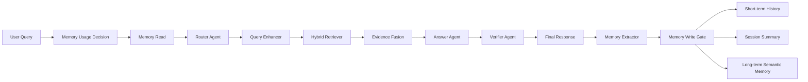

# Agentic RAG 分层记忆模块改进方案

## 0. 文档用途

本文档用于指导代码模型对现有 **Agentic RAG 可信知识问答系统** 的记忆模块进行进一步改造。

当前系统已经具备：

- 短期会话历史 Short-term Memory
- 会话摘要 Summary Memory
- 长期语义记忆 Long-term Semantic Memory
- 记忆只用于理解用户意图和偏好
- 事实回答仍必须由本轮知识库证据 `[Sx] / [Gx]` 或图谱证据 `[Gx]` 支撑

本次改造目标不是继续堆复杂 Agent，而是让记忆模块变得：

```text
可控、可解释、可追踪、可评估、不会污染事实回答
```

---

## 1. 当前记忆模块存在的问题

当前分层记忆设计已经比单纯短期记忆更完整，但仍存在以下不足：

1. **没有判断当前问题是否真的需要记忆**
   - 每次都读取记忆，可能引入无关历史。
   - 对于普通事实型问题，记忆可能反而干扰检索和生成。

2. **长期记忆缺少可信字段**
   - 当前长期记忆有 `importance`、`ttl_days`、`access_count` 等字段。
   - 但缺少 `confidence`、`status`、`source_turn_id`、`evidence_type` 等可追踪字段。

3. **长期记忆写入不够严格**
   - 需要避免每轮都把内容写入长期记忆。
   - 只应该写入用户明确偏好、长期目标、项目背景和稳定约束。

4. **会话摘要更新策略可能过重**
   - 如果每轮都重写 summary，会增加成本。
   - 长对话中 summary 反复重写可能丢失早期重要信息。

5. **长期记忆检索方式较弱**
   - 当前第一版可以使用关键词重合评分。
   - 但关键词检索无法处理“表达不同但语义相同”的记忆召回问题。

6. **缺少记忆冲突检测**
   - 用户偏好可能变化。
   - 旧记忆可能过期或与新记忆冲突。

7. **缺少记忆评估集**
   - 如果没有评估，就无法证明长期记忆模块是否真的有效。

---

## 2. 本次改造目标

本次建议将记忆模块升级为：

```text
Memory Usage Decision
  ↓
Memory Read
  ↓
Agentic RAG 主流程
  ↓
Memory Extractor
  ↓
Memory Write Gate
  ↓
Memory Store Update
```

核心原则：

```text
记忆用于理解用户，不用于替代知识库证据。
知识库证据决定事实，长期记忆决定上下文连续性和表达偏好。
```

最终系统应该能够做到：

1. 当前问题不需要记忆时，不读取长期记忆。
2. 当前问题是追问、偏好相关、跨会话延续时，读取相关记忆。
3. 长期记忆有来源、置信度、状态和过期时间。
4. 回答完成后，只写入高价值长期记忆。
5. 遇到新旧记忆冲突时，能标记旧记忆为 `contradicted`。
6. 前端或日志能展示本轮使用了哪些记忆。
7. 有专门的记忆评估脚本，能评估 Memory Recall@K、Memory Precision@K 等指标。

---

## 3. 推荐升级后整体架构



说明：

- `Memory Usage Decision`：判断当前问题是否需要读取记忆。
- `Memory Read`：读取短期历史、会话摘要、长期语义记忆。
- `Router / Query Enhancer / Retriever / Answer / Verifier`：原 Agentic RAG 主链路。
- `Memory Extractor`：从本轮对话中提取可能值得长期保存的信息。
- `Memory Write Gate`：判断是否允许写入长期记忆。
- `Memory Store Update`：更新短期历史、会话摘要、长期记忆。

---

## 4. 模块一：Memory Usage Decision

### 4.1 设计目的

不是所有问题都需要记忆。

例如：

```text
夏朝的外文名是什么？
```

这类问题应该主要依赖知识库证据，不需要长期记忆。

但下面这类问题需要记忆：

```text
继续优化我这个项目
这个怎么写进简历？
按照我之前的风格再改一下
它的外文名是什么？
```

这些问题依赖上下文、用户偏好或历史主题。

### 4.2 推荐实现位置

新增文件：

```text
hybrid_graph_rag_app/memory_policy.py
```

新增类：

```python
class MemoryUsageDecision:
    use_memory: bool
    memory_types: list[str]
    reason: str
    risk_level: str
```

新增函数：

```python
def decide_memory_usage(query: str, session_id: str, short_history: list, summary: str | None) -> MemoryUsageDecision:
    ...
```

### 4.3 输出格式

```json
{
  "use_memory": true,
  "memory_types": ["short_term", "summary", "long_term"],
  "reason": "当前问题是延续性追问，需要结合历史上下文理解",
  "risk_level": "low"
}
```

### 4.4 推荐规则

可以先用规则实现，不必每次调用 LLM。

需要记忆的情况：

```text
1. 问题中出现“继续”“刚才”“上面”“之前”“这个项目”“按照我的要求”等追问词。
2. 问题明显涉及用户偏好，例如“写得简洁一点”“按简历风格写”。
3. 问题涉及跨会话项目背景，例如“我的 RAG 项目下一步怎么改”。
4. 问题包含代词但缺少明确实体，例如“它是什么”“这个怎么优化”。
```

不需要记忆的情况：

```text
1. 明确的事实型知识库问题。
2. 一次性问答，不依赖用户历史。
3. 用户明确要求不要使用历史。
```

### 4.5 示例伪代码

```python
FOLLOW_UP_WORDS = ["继续", "刚才", "上面", "之前", "这个", "它", "该项目", "按我的", "还是", "再改"]

def decide_memory_usage(query, session_id, short_history, summary):
    if any(w in query for w in FOLLOW_UP_WORDS):
        return MemoryUsageDecision(
            use_memory=True,
            memory_types=["short_term", "summary", "long_term"],
            reason="检测到追问或上下文依赖表达",
            risk_level="low"
        )

    if "简历" in query or "项目" in query or "偏好" in query:
        return MemoryUsageDecision(
            use_memory=True,
            memory_types=["summary", "long_term"],
            reason="问题涉及用户长期项目目标或表达偏好",
            risk_level="low"
        )

    return MemoryUsageDecision(
        use_memory=False,
        memory_types=[],
        reason="当前问题不依赖历史记忆",
        risk_level="low"
    )
```

---

## 5. 模块二：长期记忆字段增强

### 5.1 当前结构

当前长期记忆类似：

```json
{
  "memory_id": "mem-...",
  "content": "用户希望回答简洁并适合写入简历。",
  "category": "preference",
  "importance": 0.8,
  "created_at": "2026-xx-xx xx:xx:xx",
  "updated_at": "2026-xx-xx xx:xx:xx",
  "last_accessed_at": "2026-xx-xx xx:xx:xx",
  "access_count": 3,
  "ttl_days": 180,
  "source": "conversation"
}
```

### 5.2 建议增强后的结构

```json
{
  "memory_id": "mem-20260605-0001",
  "user_id": "demo-user",
  "content": "用户希望项目描述偏简历表达，突出工程实现和评估指标。",
  "category": "preference",
  "importance": 0.85,
  "confidence": 0.9,
  "status": "active",
  "source": "conversation",
  "source_turn_id": "session_abc_turn_12",
  "evidence_type": "user_explicit",
  "created_at": "2026-06-05 12:00:00",
  "updated_at": "2026-06-05 12:00:00",
  "last_accessed_at": "2026-06-05 12:00:00",
  "access_count": 0,
  "ttl_days": 180,
  "tags": ["resume", "rag_project", "writing_style"],
  "contradicted_by": null,
  "metadata": {}
}
```

### 5.3 字段解释

| 字段 | 含义 |
|---|---|
| `memory_id` | 记忆唯一 ID |
| `user_id` | 用户 ID |
| `content` | 记忆正文 |
| `category` | 记忆类别 |
| `importance` | 重要度 |
| `confidence` | 置信度 |
| `status` | active / outdated / contradicted / deleted |
| `source` | 来源 |
| `source_turn_id` | 来自哪一轮对话 |
| `evidence_type` | user_explicit / system_inferred / verified_by_doc |
| `ttl_days` | 过期天数 |
| `tags` | 便于检索的标签 |
| `contradicted_by` | 被哪条新记忆冲突覆盖 |
| `metadata` | 扩展字段 |

### 5.4 记忆类别

建议保留以下类别：

| 类别 | 含义 | 示例 |
|---|---|---|
| `preference` | 用户表达偏好 | 用户希望回答简洁 |
| `profile` | 用户稳定背景 | 用户是软件工程硕士 |
| `project` | 项目长期信息 | 用户正在做 Agentic RAG 项目 |
| `constraint` | 明确约束 | 事实回答必须引用证据 |
| `task_state` | 当前任务进度 | 已完成记忆模块设计 |
| `style` | 输出风格偏好 | 喜欢 Markdown、简历式表达 |

### 5.5 记忆状态

| 状态 | 含义 |
|---|---|
| `active` | 当前有效 |
| `outdated` | 已过期 |
| `contradicted` | 被新记忆冲突覆盖 |
| `deleted` | 用户手动删除 |
| `low_confidence` | 低置信度，不默认使用 |

---

## 6. 模块三：Memory Extractor

### 6.1 设计目的

不要每轮都写长期记忆。

Memory Extractor 的作用是判断：

```text
本轮对话中是否出现值得长期保存的信息？
```

### 6.2 推荐实现位置

新增文件：

```text
hybrid_graph_rag_app/memory_extractor.py
```

新增类：

```python
class ExtractedMemory:
    should_write: bool
    content: str
    category: str
    importance: float
    confidence: float
    evidence_type: str
    tags: list[str]
    reason: str
```

### 6.3 输入

```python
query: str
answer: str
verification_result: VerificationResult
session_summary: str | None
```

### 6.4 输出示例

```json
{
  "should_write": true,
  "content": "用户希望项目描述偏简历表达，突出工程实现和评估指标。",
  "category": "preference",
  "importance": 0.85,
  "confidence": 0.9,
  "evidence_type": "user_explicit",
  "tags": ["resume", "project", "evaluation"],
  "reason": "用户明确表达了长期写作偏好"
}
```

### 6.5 哪些内容应该写入长期记忆

应该写入：

```text
1. 用户明确表达的偏好
2. 用户长期目标
3. 项目稳定背景
4. 已确认的约束条件
5. 多次出现的主题关注点
6. 当前长期任务的重要进展
```

示例：

```text
用户希望回答更适合简历。
用户当前项目是 Agentic RAG 可信问答系统。
用户希望不要只堆 Agent，而是体现检索、验证和评估。
用户希望事实回答必须有证据引用。
```

### 6.6 哪些内容不应该写入长期记忆

不应该写入：

```text
1. 普通知识库事实
2. 一次性闲聊
3. 未被证据支持的模型回答
4. 用户没有明确表达的推测属性
5. 敏感信息
6. 临时格式要求
7. 明显错误或低置信内容
```

例如：

```text
“夏朝的外文名是 Xia Dynasty”
```

这是知识库事实，不应该写入用户长期记忆。

---

## 7. 模块四：Memory Write Gate

### 7.1 设计目的

Memory Extractor 负责“提取候选记忆”，但不应该直接写入。

Memory Write Gate 负责最终判断是否允许写入。

### 7.2 推荐规则

允许写入的条件：

```text
1. should_write = true
2. confidence >= 0.75
3. importance >= 0.6
4. category 在允许范围内
5. 不属于敏感信息
6. 不是知识库事实
7. 不是短期一次性要求
```

### 7.3 伪代码

```python
ALLOWED_CATEGORIES = {"preference", "profile", "project", "constraint", "task_state", "style"}

def should_commit_memory(extracted: ExtractedMemory) -> bool:
    if not extracted.should_write:
        return False

    if extracted.category not in ALLOWED_CATEGORIES:
        return False

    if extracted.confidence < 0.75:
        return False

    if extracted.importance < 0.6:
        return False

    if is_sensitive(extracted.content):
        return False

    if looks_like_knowledge_base_fact(extracted.content):
        return False

    return True
```

---

## 8. 模块五：会话摘要滚动更新

### 8.1 当前问题

如果每轮都更新 summary，会带来：

```text
1. 成本增加
2. 延迟增加
3. 摘要反复重写可能丢失信息
```

### 8.2 推荐策略

使用滚动摘要：

```text
旧 summary + 最近新增对话 → 新 summary
```

不是每轮都触发，而是满足条件时触发。

### 8.3 触发条件

```python
if turn_count % 5 == 0:
    update_summary()

if estimated_history_tokens > 3000:
    update_summary()
```

也可以保守一点：

```python
SUMMARY_UPDATE_EVERY_N_TURNS = 5
SUMMARY_MAX_HISTORY_TOKENS = 3000
```

### 8.4 摘要内容要求

summary 不需要保存所有细节，只保存：

```text
1. 当前会话主题
2. 用户明确关注点
3. 已经确认的任务状态
4. 用户偏好和约束
5. 未完成的问题
```

### 8.5 摘要示例

```json
{
  "session_id": "demo-user",
  "summary": "用户正在优化 Agentic RAG 可信问答系统，当前重点是分层记忆模块。用户希望设计方案能直接交给代码模型实现，并且强调记忆只能用于理解用户意图，事实回答仍需知识库证据支撑。",
  "updated_at": "2026-06-05 12:10:00",
  "turn_count": 15
}
```

---

## 9. 模块六：长期记忆检索增强

### 9.1 第一版：关键词检索

当前可以先保留轻量检索公式：

```text
score = keyword_overlap + importance * 2 + access_bonus - age_decay
```

适合 MVP。

### 9.2 第二版：关键词 + 语义混合检索

建议增强为：

```text
final_score =
0.45 * semantic_similarity
+ 0.25 * keyword_score
+ 0.15 * importance
+ 0.10 * access_bonus
- 0.05 * age_decay
```

### 9.3 检索步骤

```text
1. 输入 query
2. 计算 query 和 memory.content 的关键词重合分
3. 计算 query embedding 与 memory embedding 的相似度
4. 加入 importance、access_count、age_decay
5. 过滤非 active 记忆
6. 返回 top-k 条相关记忆
```

### 9.4 推荐返回格式

```json
{
  "memory_id": "mem-20260605-0001",
  "content": "用户希望项目描述偏简历表达，突出工程实现和评估指标。",
  "category": "preference",
  "score": 0.87,
  "confidence": 0.9,
  "status": "active",
  "reason": "与当前问题中的简历项目描述高度相关"
}
```

### 9.5 读取数量控制

建议：

```python
LONG_TERM_MEMORY_TOP_K = 3
SUMMARY_MAX_CHARS = 800
SHORT_HISTORY_TURNS = 8
```

不要一次塞太多记忆进 prompt。

---

## 10. 模块七：记忆冲突检测

### 10.1 为什么需要冲突检测

长期记忆可能过时。

例如旧记忆：

```text
用户希望回答简洁。
```

新对话：

```text
这次请详细展开，不要太简短。
```

此时旧记忆不应该继续强制影响回答。

### 10.2 简单冲突规则

先做轻量规则即可：

```text
1. 新旧记忆 category 相同
2. 内容语义相反或关键词冲突
3. 新记忆 confidence 更高
4. 则旧记忆 status = contradicted
```

### 10.3 推荐实现

新增文件：

```text
hybrid_graph_rag_app/memory_conflict.py
```

新增函数：

```python
def detect_memory_conflict(new_memory, existing_memories) -> list[str]:
    ...
```

### 10.4 冲突处理结构

旧记忆：

```json
{
  "memory_id": "mem-001",
  "content": "用户希望回答简洁。",
  "category": "style",
  "status": "contradicted",
  "contradicted_by": "mem-009"
}
```

新记忆：

```json
{
  "memory_id": "mem-009",
  "content": "用户这次希望回答详细展开，不要过度简短。",
  "category": "style",
  "status": "active"
}
```

### 10.5 注意事项

不是所有不同偏好都要冲突。

例如：

```text
用户平时喜欢简洁。
用户这次要求详细。
```

这可能是临时要求，不一定要覆盖长期偏好。

因此可以区分：

```text
长期偏好 preference
本轮临时要求 temporary_instruction
```

临时要求不一定写入长期记忆。

---

## 11. 模块八：前端和日志展示

### 11.1 为什么需要展示

Agentic RAG 项目要体现“可解释”。

记忆模块也应该展示：

```text
本轮是否使用记忆？
使用了哪些记忆？
这些记忆对回答起了什么作用？
```

### 11.2 API 响应建议增加字段

在 `FinalResponse` 中增加：

```python
memory_usage: MemoryUsageDecision
used_memories: list[MemoryRecord]
memory_write_result: dict
```

返回示例：

```json
{
  "answer": "...",
  "status": "verified",
  "confidence": 0.72,
  "memory_usage": {
    "use_memory": true,
    "memory_types": ["summary", "long_term"],
    "reason": "当前问题涉及项目连续优化"
  },
  "used_memories": [
    {
      "memory_id": "mem-001",
      "content": "用户当前项目是 Agentic RAG 可信问答系统。",
      "category": "project",
      "score": 0.91
    }
  ],
  "memory_write_result": {
    "written": true,
    "memory_id": "mem-010",
    "reason": "用户明确提出新的长期优化方向"
  }
}
```

### 11.3 前端展示建议

在页面增加：

```text
记忆使用状态：
- 是否使用记忆：是
- 使用记忆类型：summary + long_term
- 使用原因：当前问题是延续性项目优化问题

本轮召回记忆：
- [M1] 用户当前项目是 Agentic RAG 可信问答系统
- [M2] 用户希望项目描述适合简历展示

本轮写入记忆：
- 写入：是
- 内容：用户希望后续方案能直接交给代码模型实现
```

---

## 12. 模块九：Prompt 约束修改

### 12.1 Answer Agent Prompt 增加记忆边界

需要明确告诉模型：

```text
你会看到三类上下文：
1. 对话历史 / 摘要 / 长期记忆：只用于理解用户意图、偏好和追问。
2. 本轮知识库证据：用 `[Sx]` 或 `[Gx]` 表示。
3. 用户当前问题。

回答中的事实性陈述只能基于本轮知识库证据。
记忆不得作为事实依据。
如果知识库证据不足，即使记忆中出现过相关内容，也必须拒答。
```

### 12.2 推荐 Prompt 片段

```text
【记忆上下文】
以下内容来自用户历史记忆，只能用于理解用户意图、偏好、表达风格和项目连续性。
不得把记忆当作事实证据。

{memory_context}

【本轮证据】
以下内容是本轮从知识库或图谱中检索到的证据。
事实性回答必须引用这些证据编号。

{evidence_context}

【回答要求】
1. 只能依据本轮证据回答事实问题。
2. 关键事实必须标注证据编号，例如 [S1] 或 [G2]。
3. 记忆只能影响表达方式、上下文理解和个性化措辞。
4. 如果本轮证据不足，请回答：知识库中没有足够依据回答该问题。
```

---

## 13. 模块十：记忆评估集

### 13.1 为什么需要评估

没有评估，记忆模块只能算功能堆叠。

需要证明：

```text
加入分层记忆后，系统是否真的更能理解追问？
长期记忆是否能被正确召回？
记忆是否会污染事实回答？
冲突记忆是否能被识别？
```

### 13.2 新增测试集

新增文件：

```text
eval/eval_memory_questions.jsonl
```

示例：

```json
{"id": "M1", "setup": "用户说：我希望回答适合写进简历。", "query": "这个项目怎么描述？", "expected_memory_keywords": ["简历", "项目描述"], "expected_use_memory": true}
{"id": "M2", "setup": "用户说：我正在做 Agentic RAG 可信问答系统。", "query": "我的项目下一步怎么优化？", "expected_memory_keywords": ["Agentic RAG", "可信问答"], "expected_use_memory": true}
{"id": "M3", "setup": "用户说：事实回答必须由证据支撑。", "query": "这个答案靠谱吗？", "expected_memory_keywords": ["证据支撑"], "expected_use_memory": true}
{"id": "M4", "setup": "用户没有提供相关背景。", "query": "夏朝的外文名是什么？", "expected_use_memory": false}
{"id": "M5", "setup": "用户过去说喜欢简洁，后来本轮说请详细展开。", "query": "请按这次要求展开说明。", "expected_conflict": true}
```

### 13.3 新增评估脚本

新增文件：

```text
eval/eval_memory.py
```

### 13.4 评估指标

| 指标 | 含义 |
|---|---|
| `Memory Usage Accuracy` | 是否正确判断需要使用记忆 |
| `Memory Recall@K` | 应该召回的记忆是否被召回 |
| `Memory Precision@K` | 召回的记忆是否相关 |
| `Conflict Detection Accuracy` | 是否正确识别记忆冲突 |
| `Answer Memory Alignment` | 回答是否遵循用户偏好 |
| `Evidence Grounding Safety` | 回答是否仍然依赖 `[Sx] / [Gx]` 证据 |
| `Latency Increase` | 引入记忆后延迟增加 |
| `Token Increase` | 引入记忆后 token 增加 |

### 13.5 输出报告

```json
{
  "total": 20,
  "memory_usage_accuracy": 0.9,
  "memory_recall_at_3": 0.85,
  "memory_precision_at_3": 0.8,
  "conflict_detection_accuracy": 0.75,
  "avg_latency_ms": 2100,
  "avg_token_increase": 380
}
```

---

## 14. 推荐文件结构调整

建议新增或修改如下文件：

```text
hybrid_graph_rag_app/
├── memory_manager.py          # 统一记忆管理入口
├── memory_policy.py           # 判断是否需要使用记忆
├── memory_store.py            # JSON / SQLite / Chroma 存储封装
├── memory_extractor.py        # 从对话中提取长期记忆候选
├── memory_conflict.py         # 记忆冲突检测
├── memory_retriever.py        # 长期记忆检索排序
├── history_store.py           # 原短期历史，可保留
├── schemas.py                 # 增加 MemoryRecord 等结构
└── data/
    ├── conversation_history.json
    ├── session_summaries.json
    └── long_term_memory.json

eval/
├── eval_rag.py
├── eval_ragas.py
├── eval_memory.py
└── eval_memory_questions.jsonl
```

---

## 15. 推荐数据结构定义

### 15.1 MemoryRecord

```python
from pydantic import BaseModel
from typing import Optional, Literal

class MemoryRecord(BaseModel):
    memory_id: str
    user_id: str
    content: str
    category: Literal[
        "preference",
        "profile",
        "project",
        "constraint",
        "task_state",
        "style"
    ]
    importance: float = 0.5
    confidence: float = 0.8
    status: Literal[
        "active",
        "outdated",
        "contradicted",
        "deleted",
        "low_confidence"
    ] = "active"
    source: str = "conversation"
    source_turn_id: Optional[str] = None
    evidence_type: Literal[
        "user_explicit",
        "system_inferred",
        "verified_by_doc"
    ] = "user_explicit"
    created_at: str
    updated_at: str
    last_accessed_at: Optional[str] = None
    access_count: int = 0
    ttl_days: int = 180
    tags: list[str] = []
    contradicted_by: Optional[str] = None
    metadata: dict = {}
```

### 15.2 MemoryUsageDecision

```python
class MemoryUsageDecision(BaseModel):
    use_memory: bool
    memory_types: list[str] = []
    reason: str = ""
    risk_level: Literal["low", "medium", "high"] = "low"
```

### 15.3 MemoryReadResult

```python
class MemoryReadResult(BaseModel):
    short_history: str = ""
    session_summary: str = ""
    long_term_memories: list[MemoryRecord] = []
    memory_usage: MemoryUsageDecision
```

### 15.4 MemoryWriteResult

```python
class MemoryWriteResult(BaseModel):
    written: bool
    memory_id: Optional[str] = None
    reason: str = ""
    skipped_reason: Optional[str] = None
```

---

## 16. 与主流程集成方式

### 16.1 原流程

```text
query
  ↓
load_history
  ↓
Query Enhancer
  ↓
Retriever
  ↓
Answer
  ↓
Verifier
```

### 16.2 新流程

```text
query
  ↓
MemoryManager.load_context()
  ↓
Router
  ↓
Query Enhancer
  ↓
Retriever
  ↓
Answer
  ↓
Verifier
  ↓
MemoryManager.update_after_response()
```

### 16.3 MemoryManager 示例接口

```python
class MemoryManager:
    def load_context(self, user_id: str, session_id: str, query: str) -> MemoryReadResult:
        ...

    def update_after_response(
        self,
        user_id: str,
        session_id: str,
        query: str,
        answer: str,
        verification_result,
    ) -> MemoryWriteResult:
        ...
```

---

## 17. 开发优先级

### 17.1 第一优先级：必须完成

```text
1. 增加 Memory Usage Decision
2. 长期记忆增加 confidence/status/source_turn_id/evidence_type
3. 增加 Memory Extractor
4. 增加 Memory Write Gate
5. 会话摘要改成滚动摘要
6. 新增 memory eval 测试集和脚本
```

### 17.2 第二优先级：简历增强

```text
1. 长期记忆检索升级为 keyword + embedding 混合检索
2. 增加记忆冲突检测
3. 前端展示本轮使用了哪些记忆
4. 支持用户手动删除记忆
5. 增加 SQLite 存储替代 JSON
```

### 17.3 第三优先级：暂时不建议做

```text
1. 不急着做 Neo4j 图记忆
2. 不急着做复杂 Memory Agent
3. 不急着实现完整个人助理式记忆系统
4. 不急着让记忆自动改写系统 Prompt
5. 不急着加入过多企业级权限系统
```

---

## 18. 验收标准

完成后，系统应该满足以下验收条件。

### 18.1 功能验收

| 功能 | 验收标准 |
|---|---|
| Memory Usage Decision | 能区分事实型问题和追问型问题 |
| Memory Read | 能读取 short history、summary、long-term memory |
| Memory Extractor | 能从对话中提取高价值长期记忆 |
| Memory Write Gate | 能过滤低价值、敏感、知识库事实类记忆 |
| Rolling Summary | 能按 turn 数或 token 阈值触发摘要 |
| Conflict Detection | 能识别明显新旧偏好冲突 |
| Frontend Display | 能展示本轮使用的记忆 |
| Memory Eval | 能输出记忆相关评估指标 |

### 18.2 安全验收

必须满足：

```text
1. 记忆不能作为事实依据。
2. 事实回答必须引用知识库证据。
3. 如果证据不足，即使记忆中出现过类似信息，也必须拒答。
4. 模型推测出的用户属性不能写入长期记忆。
5. 用户敏感信息不能写入长期记忆。
```

### 18.3 面试展示验收

项目应能展示：

```text
1. 一个追问问题如何通过短期记忆补全。
2. 一个跨会话问题如何通过长期记忆召回项目背景。
3. 一个事实型问题如何跳过长期记忆，直接走知识库证据。
4. 一个证据不足问题如何拒答。
5. 一个记忆冲突案例如何标记旧记忆。
6. 一张 memory eval 结果表。
```

---

## 19. README 可新增说明

可以在 README 中新增一节：

```markdown
## 分层记忆模块

本项目实现了轻量分层记忆模块，包括短期会话记忆、滚动摘要记忆和长期语义记忆。系统在问答前通过 Memory Usage Decision 判断当前问题是否需要读取记忆，并在需要时召回相关长期记忆辅助 Query Enhancer 和 Router 理解用户意图。回答完成后，Memory Extractor 会从本轮对话中提取高价值长期记忆候选，经 Memory Write Gate 过滤后写入长期记忆库。

需要强调的是，记忆只用于理解用户意图、表达偏好和跨会话上下文，不作为事实回答依据。所有事实性回答仍必须由本轮知识库证据 `[Sx]` 或图谱证据 `[Gx]` 支撑。若证据不足，系统会拒答而不是使用记忆补全事实。
```

---

