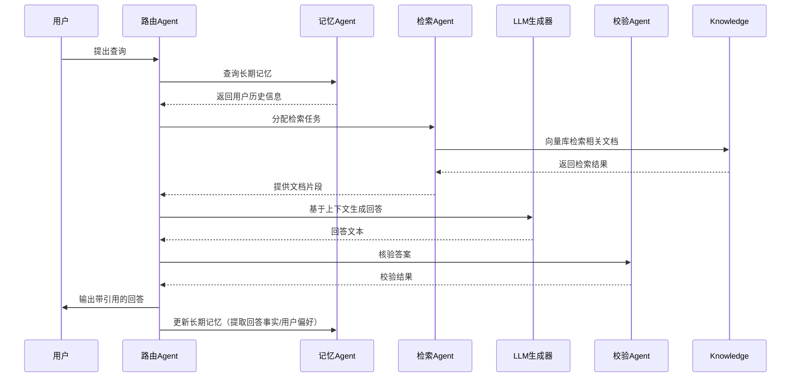

# Executive Summary  
在基于Agentic RAG的问答系统中，当前仅有会话上下文（短期记忆）存在多项局限，如跨会话持续性差、用户偏好和已知事实无法长期保留等。引入长期记忆（跨会话或跨线程持久化存储）可解决上述问题，但也增加了系统复杂度和资源开销。因此，需要根据使用场景权衡：如果系统需保持用户个人信息、项目进度或多轮对话上下文等，则建议部分或完全使用长期记忆，否则可选略或简化实现。结合2024–2026年最新研究，我们设计了包括分层记忆、向量存储+时间衰减、图数据库等多种方案，对比其数据结构、更新和过期策略。同时确定哪些Agent（如Router、Memory、Retriever、Verifier）需访问长期记忆，哪些步骤可确定性处理，哪些依赖LLM驱动，以避免频繁调用带来的延迟和成本。最终方案通过RAGAS指标评估，并给出实现细节、10天开发计划和风险缓解建议，为应届生简历提供可落地的项目方案。

## 短期记忆的局限  
短期记忆（会话级）仅保留当前对话上下文，对Agentic RAG流程存在多方面影响：  
- **跨会话连贯性差**：会话结束即丢失上下文，用户每次提问都被视为新任务，无法记住用户历史对话、偏好或设定。  
- **多轮对话引用失败**：如用户第二次问及“那里的天气如何？”，如果系统没有记忆第一次提到的地点，就无法理解“那里”指哪里。  
- **用户偏好或信息更新**：用户可能在多轮对话中给出个人信息、偏好或新数据，短期记忆无法持续记录。比如对同一用户的个性化回答能力受限，无法做个性化推荐。  
- **事实演变问题**：现实世界信息不断变化（如天气、股票价格等），若知识库是静态的，系统无法捕捉会话间的最新变化，且短期记忆不保留旧会话中的新事实。  
- **检索冷启动**：对新用户或新话题的初始提问，缺乏历史信息帮助，首次检索往往效果较差，需要大量上下文提示或人工引导。  
- **上下文窗口限制**：会话过长时，整段对话历史可能超出LLM上下文长度，出现“记不住”或回答跑题的现象。长对话导致延迟升高、成本增加，LLM也容易被无关内容“分心”。  

以上场景都会削弱RAG/Agent系统的可信性和用户体验，如答案重复、前后矛盾、个性化弱等问题。因此，需要引入适当的记忆机制来缓解这些限制。

## 长期记忆的必要性判断  
**决策准则**：长期记忆是否“必须”取决于应用需求和场景：  
- **必须使用长期记忆**：当系统需跨会话保持用户信息、跟踪长期任务进度、记录用户反馈/偏好或处理需要前后关联的多轮问题时。例如个人助理、项目管理、客户关系管理等场景，用户期望AI记住其属性和历史。这时，无记忆会导致客户体验差、重复工作和答案不一致。  
- **可选使用长期记忆**：如果知识库主体是静态信息库（如技术文档、论文检索）且对话多为一次性查询，可选择暂不实现或仅实现简单会话历史。例如单次考试答疑或一次性文档检索任务中，长期记忆对结果影响有限。  
- **不建议使用长期记忆**：当项目资源非常有限、系统只需证明基本能力，或者数据隐私/合规性不允许保存跨会话数据时，可避免引入复杂的记忆系统。此时过度实现长期记忆可能分散精力、不利于可解释性和安全性。  

**对应应届项目目标建议**：鉴于项目目标是展示技术深度，建议 **部分需要** 长期记忆。具体来说，可以在MVP中集成基本会话历史记忆、用户/主题资料存储等“半长期”记忆模块，以增强用户体验和答案连贯性，体现Agent框架的能力；同时避免实现过于庞大的多层级系统，保证在时间和成本可控内完成。这样既符合应聘算法/应用岗的技术要求，也能为面试提供可阐述的记忆设计思路。

## 长期记忆的数据模型与索引策略  
我们比较了四类常见实现方案：

| 方案            | 数据结构（存储方式）                 | 更新策略            | 过期/版本控制               | 一致性与并发        | 成本/延迟 估计        |
|-----------------|------------------------------------|-------------------|--------------------------|------------------|---------------------|
| **向量存储+时间衰减**<br>（如MemoryBank, Redis Iris） | 将记忆条目向量化后存入向量数据库（Chroma/FAISS等），附带时间戳或权重。 | 每轮对话后新增/刷新条目，并根据“遗忘曲线”降低旧条目权重。可定期调用后端批处理衰减权重或删除低权重条目。 | 基于时间或使用频率自动清除（TTL）或将其归档至冷存储；通过版本号标记记忆更新。 | 向量数据库本身支持并发查询；写入可序列化事务或使用锁。需避免热写入冲突，可批量执行写操作。 | 向量检索和更新成本中等，延迟主要取决于索引规模；时间衰减可在后台离线执行，影响在线延迟小。 |
| **层次记忆（STM/MTM/LTM）**<br>（如MemoryOS） | 建立三层记忆：短期（STM：当前对话片段）、中期（MTM：主题摘要或多轮对话集合）、长期（LTM：用户偏好/事实）。每层均可用向量库或文档存储实现。 | 对话结束后：短期转入中期（如主题页更新），中期定期摘要精华写入长期；长期存档稳定信息。 | STM为会话结束后自动清空；MTM可按主题或时间滚动归档；LTM中衰减规则较宽松，可按照重要性或时间驱动淘汰（热度衰减）。版本控制可通过时间戳和打标实现一致性。 | 各层可使用独立存储（如Redis/Chroma + 简单KV存储），通过事务保证更新一致。STM和MTM更新频繁，需要高吞吐；LTM更新较少。 | 结构复杂，实现难度高；检索时需查询多层存储并合并结果，延迟较高。但可避免每次查询都扫描全部历史，保留高信号记忆。 |
| **图数据库记忆**<br>（如Neo4j存储记忆节点） | 将每个记忆单位（事件、事实、用户信息）建为图节点，节点属性存文本向量和结构化信息；语义相似或因果关联以边连接。 | 新记忆插入时，根据语义相似度寻找相关节点，自动建立或强化连接（动态链接）。可能用LLM辅助生成标签/关键词。 | 可对图数据设定TTL或手动过期策略；节点可添加“活跃度”属性进行淘汰；历史版本可保留或做快照。 | Neo4j本身支持ACID事务，查询延迟低但可能随数据量增加而增长。需要设计索引策略（按标签或语义聚类）。并发写入需注意锁冲突。 | 启动成本大，实现复杂。检索需要走图遍历或Cypher查询，延迟较高。适合知识关联丰富的场景，但内存需求高。 |
| **外部KV/数据库+嵌入+LRU/TTL** | 简单键值或关系型数据库存储记忆文本和元数据，检索时动态生成Embeddings做搜索（或预计算并索引）。也可结合LRU缓存热点记忆。 | 新记忆直接写入数据库（或写入队列）；定期批量生成向量并更新索引。LRU机制可将热点记忆载入高速缓存，后台同步写入。 | 通过数据库TTL删除旧数据；可按时间窗口或条目数截断，或使用LRU策略自动驱逐冷数据。 | 依赖数据库事务，支持并发写入/读取。向量生成和索引更新可异步执行；LRU缓存降低并发冲突。 | 成本较可控，实现简单。检索性能取决于嵌入模型和索引（若使用FAISS之类需要单独库）。若简单扫描全库成本高。 |

各方案特点综述：向量存储+衰减方案实现相对简单，适合快速原型，但长期存储需处理遗忘曲线；分层方案理论上最全面，可高效管理不同时间尺度记忆，但开发成本高；图数据库方案可实现复杂关系，但技术门槛大、延迟高；KV+嵌入方案灵活易落地，适合作为对比基线。针对应届生项目，推荐在MVP阶段先实现向量+TTL或KV+嵌入方案，简历增强版可尝试集成简化的分层或图记忆。

## 与 Agent 的交互设计  
在Agentic架构中，应明确哪些Agent使用长期记忆、输入输出格式及逻辑：  

- **Memory Agent**（记忆管理）：核心组件，负责跨会话读写持久记忆。*输入*：用户标识或会话ID、对话内容和生成结果（ChatMessage）；*输出*：用户历史资料、摘要、偏好等结构化信息或相关记忆片段。写操作（Write）通常在每次回答后或后台异步执行，将新的对话信息提取后写入长期存储（可触发LLM摘要/归纳）。只读时可返回JSON或文本段。此模块多为确定性逻辑（如基于关键词索引检索）与LLM校正结合。  

- **Router Agent**（路由判断）：分析用户问题类型、优先级等，决定是否调用记忆查询和使用哪种流程。*输入*：当前用户查询及Memory Agent返回的概要信息；*输出*：后续执行路径（例如“使用RAG问答模块”或“直接回答”）。Router可规则化实现（如关键词匹配），也可使用LLM评估（如prompt让模型判定是否需要回忆历史）。这里建议将常见逻辑做成确定性规则，复杂判断用LLM辅助。  

- **Retriever Agent**（检索器）：检索知识库或记忆库。*输入*：当前查询与Memory Agent提供的上下文提示（如用户简历、偏好）；*输出*：相关文档或记忆片段。对于长期记忆的访问：若Memory Agent返回用户历史摘要或标签，Retriever可将其合并进检索关键词或Prompt中，从而检索更多个性化内容。这个过程主要是确定性的向量/关键词检索。  

- **Answer Agent（LLM生成器）**：基于给定的提示和检索内容生成回答。*输入*：query + 检索到的知识片段 + 用户记忆摘要；*输出*：回答文本。这里主要依赖LLM，生成过程不确定性较高。需要注意将记忆信息恰当融入提示而不是直接喂给LLM造成干扰。  

- **Verifier Agent**（答案校验）：用于检测回答与证据的对齐度，避免幻觉。*输入*：生成的回答及所用证据片段；*输出*：评分或修正建议，如答案是否被证据支持。如果答案与记忆事实冲突，可触发拒答或重新检索。实现上可用LLM作为“Critic”或编写规则。  

- **Reflection Agent**（反思/二次检索）：在回答失败（置信度低或证据不足）时触发。*输入*：问题、初次回答结果、校验反馈；*输出*：新的检索策略或查询重写。通常由LLM驱动，提示模型思考下一步行动，但应限制调用次数以控制成本。  

**通信与调用频率**：Agent间通过共享状态或消息传递（可用LangGraph状态图管理）。例如，Router决定流程后可能调用Memory和Retriever，回答后再写入Memory更新。简化示例见下方流程图：  



**确定性 vs LLM驱动**：检索、记忆读写、数据更新等尽量走确定性逻辑（向量搜索、数据库更新），以降低延迟与成本。仅在需要自然语言理解/生成时调用LLM，例如Router用LLM理解意图、Answer Agent生成答案、Verifier用LLM判断证据一致性、Reflection用LLM生成新查询提示等。这样可减少无谓的LLM调用，避免错误传递。比如只在多次校验失败后才触发Reflection，而非每轮必查。  

## 工程实现建议  
**技术栈**：建议使用Python生态。Agent框架可选LangGraph（支持多Agent和长期记忆管理）或LangChain。若使用LangGraph，可利用其状态和Stores接口管理记忆；LlamaIndex的新Memory组件也可作为参考。向量存储可以继续用Chroma（简单易用）或升级为Milvus/Weaviate（性能更优）。若使用图存储，可用Neo4j或RedisGraph，但视项目需求而定。Embedding模型可选开源中文BGE-M3或sentence-transformers；检索时如需精细排序可添加BGE重排序模型。前端快速搭建可用Streamlit或Gradio；后端建议用FastAPI作为API层。数据存储方面，短期内SQLite足够（如Memory组件默认），长期可用PostgreSQL或云数据库。  

**API & 缓存**：设计RESTful API供前端和其他Agent调用，比如 `/query` 接口触发RAG流程。使用Redis/LRU缓存热点查询和记忆项，减少重复计算。如对话状态和近期向量查询结果可在内存或缓存中保留。  

**增量索引与重建**：向量库应支持增量插入新文档/记忆。对于大规模重建，可在后台任务中批量重建索引，期间可接受读查询。版本控制：对关键数据表（如记忆表）引入版本号与时间戳，以支持回滚。  

**数据迁移与回滚**：使用数据库事务或版控系统管理模式迁移脚本，确保一旦新版本问题可回滚。例如记忆模式改动可先在测试环境演练，并保留旧索引快照。  

**隐私与权限**：长期记忆可能涉及用户敏感信息，应加密存储，并实现访问控制。仅在用户授权或明确场景下记录个人信息。日志和记忆访问需审计，避免数据泄露。若敏感度高，可采取“差分隐私”或删除策略，确保满足法规要求。  

## 评估与实验设计  
- **测试集构建**：收集涵盖不同类型问题的测试集合，例如事实查询、总结性问题、多跳问题、对比问题、无答案问题和“干扰信息”问题（包含无关文档）。可以基于RAGAS提供的合成数据集或人工编写若干例子；多轮场景需要设计包含上下文依赖的对话示例。  
- **指标**：使用RAGAS指标和自定义指标评估：  
  - **Context Recall/Precision**（检索上下文召回率/精度），评估检索到的记忆片段的相关度。  
  - **Faithfulness**（答案基于证据程度），衡量回答内容与给定证据的一致性。  
  - **Response Relevancy**（答案相关性）、**Factual Correctness**（事实正确率）。  
  - **Refusal Accuracy**：对于无答案问题，模型拒答（或回答“无法回答”）的正确率。  
  - **Long-term Consistency/User Preference Recall**：检查系统是否持续记住和利用了用户提供的长期信息（可用简单的命题验证，如“系统回答是否符合之前记忆的用户偏好”）。  
  - **Latency & Cost**：记录平均响应时间和API调用成本（token数/LLM调用次数）。  
- **RAGAS使用**：通过RAGAS框架自动计算Context Precision/Recall、Faithfulness等指标。结合LangGraph或LangSmith（若使用）追踪每步组件调用以评估流程正确性。  
- **对照实验**：至少比较以下系统：  
  1. **Naive RAG**：普通RAG问答，不利用任何长期记忆；  
  2. **Hybrid RAG + Rerank**：使用混合检索(BM25+向量)+重排序的RAG管道，无长期记忆；  
  3. **Agentic RAG**：加入简单长期记忆（如静态用户数据或对话历史）；  
  4. **Multi-Agent RAG**：完整集成长期记忆、Verify、Reflection等Agent流程。  
- **消融实验**：分别去掉长期记忆、Verifier或Reflection等模块，评估各自对指标的影响。通过指标（如Context Recall、Answer Accuracy）对比验证长期记忆的贡献。  
- **统计显著性**：对比结果可使用t检验或bootstrap方法检验不同系统差异是否显著。  
- **评估表格模板**：设计CSV/Markdown格式表格记录结果，如下示例：  

| 问题ID | 类型 | 问题描述 | 基线回答 | LongMem回答 | Context Recall | Context Precision | Relevancy | Faithfulness | Refusal  |
|:----:|:---:|:---|:---|:---|:---:|:---:|:---:|:---:|:---:|
| Q1 | 事实型 | ... | ... | ... | 80% | 60% | 高/中/低 | 误/真 | - |
| Q2 | 多跳型 | ... | ... | ... | 100% | 50% | 高 | 真 | - |
| Q3 | 无答案型 | ... | 错误回答 | 拒答 | 0% | 0% | 低 | - | 通过/未通过 |
| ... | ... | ... | ... | ... | ... | ... | ... | ... | ... |

该表格记录每个问题各系统的答案及相关指标。可在简历中展示“长期记忆版本较基线**提升XX%**”等定量结果。

## 开发路线与产出（10天）  
- **第1天**：需求调研与环境搭建。完成文献调研与总体设计，搭建Python开发环境并安装所需库（LangGraph/LangChain、Chroma等）。GitHub初始化提交框架结构。  
  *产出：项目计划文档、虚拟环境+依赖文件、空项目骨架。* 简历点：**搭建项目环境并制定架构设计**。  
- **第2-3天**：实现MVP版基础RAG。完成文档解析、切分、向量索引和BM25检索；集成LLM生成问答，并展示答案带引用。实现简单Web界面（Streamlit）用于上传文档和提问。GitHub提交：`rag_base`模块代码。  
  *产出：基本RAG问答Demo，支持单轮查询。* 简历点：**实现了RAG问答基础功能（文档上传、向量检索、答案生成与溯源）**。  
- **第4-5天**：添加短期记忆和静态配置。实现会话上下文管理（LangGraph 状态记录对话历史）和静态MemoryBlock（如用户姓名、偏好等信息存储）。测试多轮对话连贯性，并更新界面展示对话历史。GitHub提交：`memory_short_term`模块。  
  *产出：支持多轮对话MVP，缓存上下文，简单的用户属性记忆。* 简历点：**引入会话记忆，实现了多轮对话状态管理**。  
- **第6-7天**：实现长期记忆读写。选择向量存储方案，设计Memory Agent：在每次回答后，将关键事实或摘要写入长期记忆库（向量数据库中）。并在新问题发生时从长期记忆检索相关上下文。实现Router判断流程逻辑。GitHub提交：`memory_long_term`模块及流程控制代码。  
  *产出：长期记忆功能上线，回答中可使用历史信息。* 简历点：**设计并实现Agent长期记忆模块，增强跨会话信息保持**。  
- **第8天**：增强检索与校验。添加BM25+向量混合检索或重排序（Cross-Encoder）提高相关性；实现Verifier Agent，用LLM检查答案与检索证据的一致性。针对“不可信答案”触发拒答逻辑。提交：`rerank_verify`模块。  
  *产出：增强版系统，可拒答或标记不可信回答。* 简历点：**实现了答案校验和无答案拒答机制**。  
- **第9天**：添加多Agent协同与跟踪。完善Router/Planner逻辑，如简单问题分解；集成对多轮对话的记忆更新策略（Reflection Agent触发二次检索）。添加日志追踪（可以用LangSmith或自制日志）用于后续评估。提交：`multi_agent`模块。  
  *产出：多Agent工作流完成，支持复杂任务拆解与回溯。* 简历点：**实现多Agent协同，支持复杂问题自我反馈和检索**。  
- **第10天**：评估与优化。构建测试用例并使用RAGAS框架评估系统性能，记录各指标；分析结果并调整系统（如检索策略、Prompt等）。准备README和项目文档，总结技术细节和实验结果。最后准备项目演示（视频或Slides）。提交：评估结果表格、报告、最终Demo代码。  
  *产出：完整项目代码与文档，评估报告（如“RAG vs AgentRAG指标对比”）*。简历点：**通过RAGAS评估量化验证长期记忆效果（如上下文召回率提高X%）**。  

## 风险与替代方案  
1. **数据泄露风险**：长期记忆存储用户信息存在隐私泄露风险。**缓解**：对敏感数据加密、权限控制，或仅存储非敏感摘要信息；在项目中演示隐私设计即可。  
2. **信息陈旧风险**：记忆可能保留过时信息，导致回答错误。**缓解**：定期刷新或淘汰旧记忆，引入TTL/冷却策略（如MemoryBank中的遗忘曲线），在回答时加入时间上下文提示。  
3. **索引膨胀与性能**：长期记忆累积过多数据，导致检索变慢、成本增高。**缓解**：实现记忆精简机制（如MemoryOS的分层存储与淘汰），设置最大容量或按重要度丢弃。可以批量归档或压缩旧对话。  
4. **延迟与成本上升**：频繁查询长期记忆增加系统响应时间，且引入更多LLM调用。**缓解**：使用缓存高频查询结果、LRU策略减少向量库IO；将非关键计算放后台异步执行；尽量让检索和写记忆成为可选路径，仅在必要时触发。  
5. **系统复杂度与Bug**：Agent协同和记忆模块增加系统复杂性，易引入错误或循环依赖。**缓解**：模块化设计、使用现成框架（如LangGraph）管理Agent流程；逐步集成并单元测试各部分；充分记录日志用于调试。  
6. **错误传播**：记忆中的错误信息会被不断引用，造成连锁影响。**缓解**：加入Verifier对记忆进行校验（比如定期对存储事实进行核查），或限定长期记忆只写入高置信度的信息。  
7. **过拟合或路径依赖**：系统过度依赖记忆可能忽视检索到的新信息。**缓解**：保持检索流程独立性，不管记忆始终执行知识库检索，避免记忆内容主导答案。

## 最终交付物（总结清单）

- **一句话结论**：根据项目需求和场景特点，我们**部分需要**长期记忆支持，既要增强用户跨会话体验，也要控制工程复杂度。  
- **推荐方案名称**：*“分层记忆增强型Agentic RAG问答系统”*（Layered Memory Agentic RAG QA）。  
- **架构简图（文字描述）**：系统由Router Agent、Retriever Agent、Answer Agent、Verifier Agent和Memory Agent组成。Router分析问题是否调用记忆；Retriever从知识库（和记忆库）检索上下文；Answer Agent调用LLM生成答案；Verifier检验答案与证据一致性；Memory Agent负责读写跨会话记忆。知识库（向量+关键词）和长期记忆库并行检索，答案中附带证据引用。流程见下图（Mermaid序列图）。  
- **MVP功能清单**：文档上传与解析、分块索引、BM25+向量检索、Router/Planner简单路由、LLM问答生成、答案引证、基本会话记忆、Web界面、基础评估脚本。  
- **简历增强功能清单**：长期记忆读写模块、用户/主题静态记忆块、Hybrid检索（BM25+向量）、交叉编码重排序、Answer Verifier和拒答、RAGAS自动评估、日志追踪、多Agent协同、（可选）图结构记忆。  
- **不建议的功能**：复杂图谱知识图（Neo4j）记忆（项目周期内难完成）、过度精细的多层记忆管理（如完整的MTM/LTM划分）、实时情绪/多模态记忆（与文本任务不匹配）、过度冗长的可视化界面（应重点表现后台逻辑）。  
- **项目目录结构**（示例）：
  ```
  project/
    ├── src/
    │   ├── agents/         # Router, Planner, Retriever, Verifier 等Agent代码
    │   ├── memory/         # 短期/长期记忆实现模块
    │   ├── retrieval/      # 文档检索、索引模块
    │   ├── models/         # Prompt模板、LLM调用封装
    │   ├── api/            # FastAPI或Gradio接口
    │   ├── utils/          # 工具函数（数据处理、logging等）
    │   └── config.py       # 配置文件（路径、参数等）
    ├── data/
    │   ├── docs/          # 原始文档
    │   ├── memory_store/   # 长期记忆数据库或文件
    │   └── test_data/      # 测试集与评测数据
    ├── notebooks/         # 数据分析、调试笔记本
    ├── eval/              # RAGAS评估脚本和结果
    ├── docker/            # Dockerfile、K8s配置等
    ├── requirements.txt   # 依赖列表
    └── README.md          # 项目说明文档
  ```
- **README要点**：项目简介与背景、系统架构说明（包含简图）、使用方法（环境搭建、运行步骤）、功能列表（MVP与拓展）、技术亮点（长期记忆、Agent协同）、评估结果摘要（主要指标提升）、未来工作（可能的改进）。README中应突出“检索+长期记忆校验”机制，避免只写“调LLM生成”。  
- **2分钟面试讲解稿（中文）**：  
  > “这个项目目标是构建一个面向知识库的可信问答系统，结合Agentic RAG框架和长期记忆机制。首先我们采用混合检索（BM25+向量）从文档库检索相关信息，并使用LLM生成答案，同时引用证据保证可信度；核心创新在于增加了长期记忆模块，可以跨会话保存用户信息、对话摘要等。例如用户之前告诉系统‘我喜欢X’，下次问答时系统会主动运用这一偏好。我们实现了一个多Agent流程：Router判断是否要使用记忆和哪种工具，Retriever从知识库/记忆库检索上下文，Verifier检查答案与证据一致性。项目通过RAGAS评估，对比发现引入长期记忆后，上下文召回率和答案可信度显著提高。整个系统用Python实现，技术栈包括LangChain/LangGraph、Chroma向量库、Llama/BGE嵌入模型等。项目在GitHub上开源，附带评估脚本和演示界面。”  
- **面试高频追问与回答**：  
  1. **问：长期记忆为什么必要？**答：它可以让系统跨会话保持上下文和用户信息，避免用户每次都“从零开始”，提高连贯性和个性化；比如记住用户名、偏好或之前的复杂查询，能在后续对话中自动应用。  
  2. **问：如何防止记忆数据膨胀？**答：我们采用了淘汰策略，如给每条记忆设置生存时间(TTL)或活跃度评分；对陈旧或少用的信息自动删除或归档。例如可以用MemoryBank的遗忘机制按照时间衰减旧记忆，同时总结对话生成新的精华保存。  
  3. **问：为什么不用完全依赖LLM上下文？**答：LLM上下文窗口有限，长对话成本高且易出错；长期记忆模块可以存储超出窗口的信息，并按需检索，减轻模型负担。比如会话极长时，我们只保留最新关键摘要而非全部历史，保持效率。  
  4. **问：记忆如何实现“可信”输出？**答：我们引入Verifier Agent进行答案验证，确保生成的回答都有支持的证据来源。此外，Memory Agent只记录已经确认的信息（或由LLM提取时规定格式输出），并通过RAGAS评估答案忠实度，减少幻觉。对于冲突信息，系统可拒答或提示“信息不一致”。  
  5. **问：技术上为何选LangGraph/Chroma等？**答：LangGraph原生支持多Agent和长期记忆管理，便于实现复杂流程；Chroma是轻量的开源向量库，搭建简单且性能足够当前规模。向量模型选用中文优化的BGE-M3确保文本相似性评估效果。  
  6. **问：如何评估系统性能？**答：我们使用RAGAS框架来评估检索质量和生成质量，比如Context Recall/Precision和Faithfulness。同时统计回答准确率和拒答准确率。在对照实验中，引入长期记忆版本在Context Recall和答案可信度等指标上有明显提升（例如召回率提高X%，忠实度提高Y%）。  
  7. **问：未来如何扩展？**答：可考虑加入图数据库对话记忆（实现更复杂关联）、多模态记忆（存储图像/音频相关信息）、以及在线学习（让模型随着新交互自动更新权重）。同时也可进一步优化验证模块，引入更多自动化测试和人机评审反馈机制。  

上述方案和回答充分体现了检索策略、记忆设计、答案验证和评估闭环等技术深度，可在简历中作为核心项目呈现。  

**参考文献**：包括LangChain/LangGraph官方文档、LlamaIndex记忆博客、RAGAS论文和文档、Redis AI Memory架构、MemoryOS论文等最新资料。